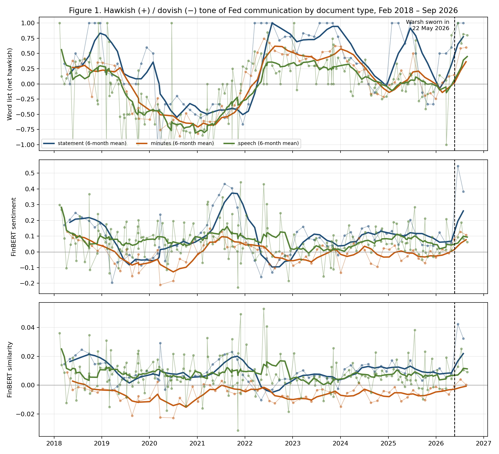

# Assignment 2 Report

### Evaluating the Impact of FOMC Communications on Asset Prices

FRE-GY 7871 A · NLP and the Investment Process · Fall 2026

<strong>Name:</strong> Yuri Moghaddam Nasrollahi 
<strong>NetID:</strong> ym3414 
<strong>GitHub repo:</strong> https://github.com/Yuri48/FinEng (folder <code>HW2</code>) 
<strong>Data as of:</strong> 14 September 2026 (market data through 11 September)

---

## 1. Summary

Kevin Warsh has been Chair for 115 days and has signed two post-meeting statements, two sets of
minutes, two press conferences, one round of testimony and one speech. Every one of the three tone
measures I built says the same thing about those eight documents: they are the most hawkish run of
Fed communication in the sample. Warsh's two statements score at the ceiling of the word-list
measure (net hawkish = +1.00, against a Powell mean of +0.25) and sit above every one of Powell's
68 statements on both FinBERT measures. They are also less than half the length of a Powell
statement (152 words against 383), with the forward-guidance paragraph removed entirely and
replaced by the sentence "The Committee will deliver price stability".

The market-reaction evidence is weaker than the tone evidence, as it is in the readings. Once the
same-day change in the 3-month bill absorbs the rate decision, tone *levels* explain nothing on the
pooled sample of 307 releases (Table 3, Panel A). What does move markets is the *change* in tone
from one document to the next: a one-standard-deviation hawkish shift in the word list lifts the
1-year yield by 0.4 bp and growth-minus-value by 0.17 percentage points (Panel C), and a hawkish
shift in either FinBERT measure of a statement flattens the 10s2s curve by 1.1 to 1.3 bp (Panel D).
Two of Warsh's three hawkish surprises (the June statement, Jackson Hole) produced exactly that
pattern: the dollar up half a percent, the 1-year yield up 11 to 14 bp, 10s2s 8 to 9 bp flatter.

For 16 September I put a hike at 70 percent, a hold at 29 and a cut at 1. Fed funds futures price
a hike at roughly 85 percent, so the reaction to the decision itself should be small; the
statement's language cannot get more hawkish on the word-list scale than it already is, and the
one-day moves I expect are close to zero on average with fat tails in both directions. The position
I would take is a small 2s10s flattener, which pays off in the modal hike-plus-hawkish-language
outcome and which a hold or a softened statement would prove wrong.

## 2. Data

**Documents.** I collected every FOMC post-meeting statement and every set of minutes from February
2018 to today from the Board's calendar pages, and every speech and congressional testimony by the
sitting Chair from the Board's JSON feeds. Press-conference transcripts were downloaded as PDFs and
reduced to the Chair's own words (opening statement plus answers), dropping the reporters'
questions. Minutes are dated by their release day, three weeks after the meeting. Each document
carries a release date and a time in Eastern time: 14:00 for statements and minutes, 14:30 for press
conferences, and the time printed in the feed for speeches and testimony. Speeches Powell gave
as a Governor after 22 May 2026 are excluded, since he was no longer Chair. Table 1 counts the
result.

**Table 1. Documents collected, by type and by Chair**

| Document         |   Powell |   Warsh |   Total |   Median words |
|:-----------------|---------:|--------:|--------:|---------------:|
| Statement        |       68 |       2 |      70 |            351 |
| Minutes          |       64 |       2 |      66 |           7964 |
| Press conference |       64 |       2 |      66 |           6550 |
| Speech           |       78 |       1 |      79 |           1286 |
| Testimony        |       26 |       1 |      27 |           1274 |
| All documents    |      300 |       8 |     308 |           2749 |

Powell: 5 February 2018 to 21 May 2026. Warsh: 22 May 2026 (oath of office) to 14 September 2026. Statements include the two unscheduled March 2020 statements. Press conferences are the Chair's words only.

**Indicators.** DXY (Yahoo, DX-Y.NYB), the 10-year minus 2-year Treasury spread (FRED, T10Y2Y), the
1-year constant-maturity yield (FRED, DGS1), and Russell 1000 Growth minus Russell 2000 Value as the
IWF daily return minus the IWN daily return (Yahoo, adjusted closes). The control is the 3-month bill
(FRED, DGS3MO). Day 0 is the release date when the release is before 16:00 ET on a trading day and
the next trading day otherwise; every change is close-to-close from the previous trading day, in
percent for DXY and growth-minus-value and in basis points for the yields. 307 of the 308 releases
have a usable day 0 with all four indicators; the exception is a Powell speech on Columbus Day 2025,
when the bond market was closed.

## 3. Tone measures

**Word list.** I built a phrase list for monetary-policy language rather than reusing a general
sentiment dictionary: 56 hawkish and 55 dovish regular-expression patterns in four themes. Inflation
("higher inflation", "inflation remains elevated", "price pressures" vs "inflation has eased",
"disinflation", "below the 2 percent objective"); activity ("solid pace", "strong demand" vs "slowed",
"downside risks to the outlook", "recession"); labor ("tight labor market" vs "unemployment has
risen", "labor market has cooled"); and policy ("raise the target range", "restrictive", "deliver
price stability" vs "lower the target range", "accommodative", "asset purchases"). A "not", "no" or
"never" within three words before a match flips its sign, so "inflation has not eased" counts as
hawkish. The document score is (H − D)/(H + D), bounded in [−1, +1].

**FinBERT.** Every document is split into sentences (176 on average; 500 for the longest minutes)
and each sentence is run once through `ProsusAI/finbert`. From the same forward pass I take two
scores. *FinBERT sentiment* is the mean of P(positive) − P(negative) from the classification head.
*FinBERT similarity* is the mean over sentences of cos(sentence, hawkish anchors) minus cos(sentence,
dovish anchors), where the anchors are eight paired key sentences such as "Interest rates will rise"
/ "Interest rates will fall" and "The Committee will act to restore price stability" / "…to support
the economy", embedded by mean-pooling FinBERT's last layer. The similarity score is the one that
measures policy direction; the sentiment score measures optimism about the economy, which in Fed
language leans hawkish but is not the same thing.

The two FinBERT scores are close to redundant (correlation 0.89 to 0.91 within each document type),
and neither is correlated with the word list (−0.12 to +0.21). That is the first result: a lexicon
built for policy direction and a model trained for financial sentiment are measuring different
dimensions of the same text.

### Figure 1. Hawkish/dovish tone over time by document type

Dots are individual documents; heavy lines are six-month rolling means by type. Dashed line: Warsh sworn in, 22 May 2026. Top panel: word list, (H − D)/(H + D). Middle: FinBERT sentiment, mean P(pos) − P(neg). Bottom: FinBERT hawkish-minus-dovish anchor similarity.

The word list reproduces the cycle as a reader would tell it. Statements turn dovish in mid-2019
with the "insurance" cuts, hit −0.5 through the pandemic, swing to +1.0 in 2022 when every paragraph
was about elevated inflation and raising the target range, drift back toward zero over the 2024–25
easing, and then jump to the ceiling in June 2026. Minutes and speeches follow the same path with
smaller amplitude, as expected from documents that record a range of views or discuss other topics.
The FinBERT panels are flatter and their big statement excursion is 2021–22, when the statements
described "strong" job gains and "solid" activity: sentiment reads the description of the economy,
not the policy conclusion.

### Warsh versus Powell

| Document type | Score | Powell mean | Powell, last 12 months | Warsh mean | Warsh's mean as a percentile of Powell | Mann–Whitney p |
|:--|:--|--:|--:|--:|--:|--:|
| Statement | Word list | +0.25 | +0.29 | +1.00 | 81st | 0.05 |
| Statement | FinBERT sentiment | +0.08 | +0.08 | +0.47 | 100th | 0.003 |
| Statement | FinBERT similarity | +0.009 | +0.009 | +0.037 | 100th | 0.001 |
| Minutes | Word list | +0.02 | +0.04 | +0.59 | 94th | 0.02 |
| Minutes | FinBERT sentiment | −0.01 | −0.01 | +0.12 | 95th | 0.02 |
| Minutes | FinBERT similarity | −0.006 | −0.005 | +0.002 | 94th | 0.02 |
| Speech | Word list | −0.10 | −0.01 | +0.82 | 96th | 0.002 |
| Speech | FinBERT sentiment | +0.07 | +0.06 | +0.11 | 70th | 0.24 |
| Speech | FinBERT similarity | +0.008 | +0.007 | +0.014 | 77th | 0.09 |

Warsh n = 2 statements, 2 minutes, 4 speeches (two press conferences, one testimony, one speech). "Last 12 months" is Powell from 22 May 2025. The percentile is the share of Powell's documents scoring below Warsh's mean.

Three things stand out. First, the shift is on every measure and every document type, and it is
against Powell's last year as well as his whole term, so it is not an artefact of the 2019–21 easing
dragging down the baseline. Second, it is largest in the documents Warsh controls most directly. His
statements contain no dovish phrase at all (the theme breakdown is 1.0 inflation-hawkish, 2.0
activity-hawkish, 1.5 policy-hawkish, zero on every dovish theme) where a Powell statement averaged
1.6 dovish policy phrases, mostly "accommodative" and "lower the target range". Third, the shift is
partly a change in *form*. Warsh's statements are 134 and 170 words; they drop the paragraph on how
the Committee will assess "the extent and timing of additional adjustments" and the "attentive to the
risks to both sides of its dual mandate" language, and add a one-sentence commitment. With fewer
words, each hawkish phrase weighs more, which is why the word list saturates at +1.0. The FinBERT
similarity score, which does not saturate, still puts both statements four standard deviations above
Powell's mean. The minutes, written by staff for a twelve-member Committee, move less (+0.59 against
+0.02) but in the same direction, and record three dissents in favour of a hike in July.

## 4. Market reactions

**Table 2. One-day change in the four indicators after each Warsh-era release, with that release's tone scores**

| Release    | Document         | Title                    |   Word list |   FinBERT sent. |   FinBERT sim. ×100 |   ΔDXY (%) |   Δ10s2s (bp) |   Δ1y (bp) |   ΔG−V (%) |   Δ3m bill (bp) |
|:-----------|:-----------------|:-------------------------|------------:|----------------:|---------------:|-----------:|--------------:|-----------:|-----------:|----------------:|
| 2026-06-17 | Statement        | Hold, 12–0                |        1.00 |           0.547 |           4.23 |      +0.55 |            −9 |        +14 |      −0.26 |              +4 |
| 2026-06-17 | Press conference | 17 June 2026             |        1.00 |           0.093 |           1.29 |      +0.55 |            −9 |        +14 |      −0.26 |              +4 |
| 2026-07-08 | Minutes          | June meeting             |        0.58 |           0.128 |           0.40 |      −0.09 |            −1 |          0 |      +1.51 |              +1 |
| 2026-07-14 | Testimony        | Semiannual, House        |        0.67 |           0.187 |           2.52 |      −0.34 |            +4 |        −10 |      +1.43 |              −5 |
| 2026-07-29 | Statement        | Hold, 9–3 (3 for a hike)  |        1.00 |           0.384 |           3.24 |      −0.57 |           +10 |         −5 |      −0.97 |              −7 |
| 2026-07-29 | Press conference | 29 July 2026             |        0.82 |           0.084 |           1.05 |      −0.57 |           +10 |         −5 |      −0.97 |              −7 |
| 2026-08-19 | Minutes          | July meeting             |        0.60 |           0.108 |           0.02 |      −0.82 |            −6 |         +1 |      −0.84 |               0 |
| 2026-08-28 | Speech           | Jackson Hole, "In Our Time" |     0.80 |           0.063 |           0.90 |      +0.54 |            −8 |        +11 |      −0.21 |              +6 |

Statement and press conference on the same afternoon share one day-0 change. Powell-era averages for a statement day: |ΔDXY| 0.40, |Δ10s2s| 3.6 bp, |Δ1y| 3.9 bp, |ΔG−V| 0.94.

The June statement and the Jackson Hole speech are textbook hawkish surprises: the dollar up 0.55
percent, the 1-year yield up 14 and 11 bp, the curve 8–9 bp flatter, growth underperforming value.
Both are three-times-normal moves for a statement day. The July hold is the interesting one. The
statement scored just as hawkish as June's on the word list (identical text plus three hawkish
dissents), yet the market took it as dovish: the dollar fell 0.57 percent, the 1-year fell 5 bp, the
curve steepened 10 bp. The explanation is the surprise, not the level. By 29 July futures had moved
to price a September hike and a growing chance of a July one; a hold with unchanged language was
*less* hawkish than expected. That is the Doh, Song and Yang point in one observation: markets
respond to tone relative to expectations, not to tone.

**Table 3. Each indicator's one-day change regressed on each tone score, with the 3-month bill control**

Δyi = a + b·z(tonei) + c·ΔDGS3MOi + document-type dummies + ei, HC1 standard errors.
Cells show b with the t-statistic in parentheses; b is the effect of a one-standard-deviation more hawkish document. Stars: * p<0.10, ** p<0.05, *** p<0.01.

*Panel A. All 307 releases, tone level*

| Tone score              | DXY (%)        | 10s2s (bp)     | 1y yield (bp)   | Growth − value (%)   |
|:------------------------|:---------------|:---------------|:----------------|:---------------------|
| Word list (net hawkish) | −0.017 (−0.70) | +0.039 (0.16)  | −0.171 (−0.71)  | +0.090 (1.08)        |
| FinBERT sentiment       | +0.039 (1.60)  | +0.048 (0.19)  | −0.097 (−0.35)  | −0.055 (−0.80)       |
| FinBERT similarity      | +0.036 (1.33)  | −0.122 (−0.43) | −0.215 (−0.74)  | −0.004 (−0.05)       |

*Panel B. The 70 post-meeting statements, tone level*

| Tone score              | DXY (%)        | 10s2s (bp)     | 1y yield (bp)   | Growth − value (%)   |
|:------------------------|:---------------|:---------------|:----------------|:---------------------|
| Word list (net hawkish) | −0.029 (−0.58) | +0.290 (0.53)  | −0.675 (−1.13)  | +0.066 (0.45)        |
| FinBERT sentiment       | +0.069 (1.46)  | +0.284 (0.45)  | +0.894 (1.56)   | −0.218** (−2.45)     |
| FinBERT similarity      | +0.079* (1.67) | −0.205 (−0.29) | +1.296** (2.02) | −0.110 (−0.92)       |

*Panel C. All releases, change in tone since the previous document of the same type (N = 302)*

| Tone score              | DXY (%)       | 10s2s (bp)     | 1y yield (bp)   | Growth − value (%)   |
|:------------------------|:--------------|:---------------|:----------------|:---------------------|
| Word list (net hawkish) | +0.021 (0.96) | −0.154 (−0.80) | +0.435** (2.19) | +0.169*** (3.04)     |
| FinBERT sentiment       | +0.028 (1.20) | −0.197 (−0.86) | −0.352 (−1.25)  | +0.035 (0.50)        |
| FinBERT similarity      | +0.029 (1.36) | −0.167 (−0.76) | −0.336 (−1.45)  | +0.075 (1.08)        |

*Panel D. Statements only, change in tone since the previous statement (N = 69)*

| Tone score              | DXY (%)        | 10s2s (bp)        | 1y yield (bp)   | Growth − value (%)   |
|:------------------------|:---------------|:------------------|:----------------|:---------------------|
| Word list (net hawkish) | −0.061 (−1.16) | −0.708 (−1.50)    | +0.765 (1.26)   | +0.041 (0.30)        |
| FinBERT sentiment       | +0.062 (1.43)  | −1.264*** (−3.12) | +0.354 (0.46)   | +0.080 (0.56)        |
| FinBERT similarity      | +0.035 (0.76)  | −1.137*** (−2.59) | +0.530 (0.70)   | +0.190 (1.24)        |

The 3-month bill control is significant in every specification for DXY (+0.04% per bp, t ≈ 4.5), 10s2s (−0.43 bp per bp, t ≈ −5.9) and the 1-year yield (+0.96 bp per bp, t ≈ 9.7; R² = 0.34 on its own), and never for growth-minus-value. Full coefficient tables are in the notebook and in <code>outputs/</code>.

Three conclusions. First, the control does its job: the rate decision, as the bill sees it, explains
a third of the release-day move in the 1-year yield and a tenth of the moves in DXY and the curve,
and the words are only credited with what is left. Second, tone *levels* carry no information on the
pooled sample (Panel A: nothing within 1.6 standard errors of zero), and only marginally on
statements alone (Panel B: a hawkish statement by FinBERT similarity adds 1.3 bp to the 1-year and
0.08 percent to the dollar). A hawkish statement that says what the last one said is not news. Third,
tone *changes* do carry information, and with the signs one would want. In Panel C a one-standard-deviation
 hawkish shift in the word list adds 0.44 bp to the 1-year and 0.17 percentage points to
growth-minus-value beyond the bill; in Panel D a hawkish shift in either FinBERT measure of a
statement flattens 10s2s by 1.1 to 1.3 bp, with t-statistics of 2.6 and 3.1.

I would not over-read these. Forty-eight coefficients are estimated across the four panels and five
are significant at 5 percent, against two or three expected by chance; the two strongest (Panel D,
10s2s) are the same result twice given the 0.89 correlation between the FinBERT scores. The
economic size is also modest: one standard deviation of statement-tone change moves the curve by a
third of a typical statement-day move. What the table does establish is the ordering that the
readings predict: surprise beats level, and the front end and the curve respond before the dollar
and the equity factor do.

## 5. How this compares with the readings

**Doh, Kim and Yang (2021)** measure the tone of 87 statements from March 2004 to December 2014
by the semantic distance, under Google's Universal Sentence Encoder, between the released statement
and the staff's dovish (Alt. A) and hawkish (Alt. C/D) drafts, then multiply tone by novelty (distance
from the previous statement) to get a change in stance. Their September 2007 and October 2013
examples show the qualitative description of the outlook moving the tone as much as the size of the
rate cut. I do not have alternative statements (they are released with a five-year lag, so none exist
for the Powell or Warsh eras) and cannot use their factor-similarity design. My substitutes are the
word list and the FinBERT anchor similarity; my equivalent of their novelty × tone is the
change-in-tone regressor in Panels C and D. The finding that only the *change* matters is the same
finding: their tone measure is only useful once it is differenced against the prior statement and the
market's expectation.

**Doh, Song and Yang (2020, updated 2025)** go further and back out the market's expected tone from
the intraday bond reaction, decomposing each statement into an expected and a surprise component.
Their surprise correlates 0.70 to 0.80 with the Swanson and Nakamura–Steinsson high-frequency
shocks, and a surprise that raises the 1-year yield by 25 bp lowers stocks by 2 to 3 percent. Two of
my results line up with theirs. The bill control is my crude version of their expected component,
and it removes a third of the 1-year move. And the July 29 hold, hawkish in level but dovish against
expectations, is the counterfactual they describe: the same words can be a hawkish or a dovish shock
depending on what was priced. Where I differ is scale and resolution. They use 10-minute windows;
I use close-to-close changes, which add a full afternoon of other news to every observation and are
part of why my t-statistics are one-tenth of theirs.

**"Parsing the Fed" (2021)** compares the same four indicators used here across factor similarity, a
word list and FinBERT sentiment. My version of that horse race comes out the same way its
methodological ordering suggests. The word list is the most interpretable measure and the one whose
*changes* move the front end and the factor; FinBERT sentiment, as the presentation also notes, is
a measure of economic optimism rather than of policy direction, which is why it is uncorrelated with
the word list and why its statement-level excursion in Figure 1 is 2021–22 rather than 2022–23. The
anchor-similarity score is the cheapest way to make FinBERT read for policy direction without the
alternative statements, and it behaves like the sentiment score because mean-pooled BERT embeddings
are dominated by topic and register rather than by the direction of a verb.

One result is new relative to the readings, because the readings end before it happened: the Warsh
shift is as much a change in the *form* of the statement as in its tone. A 150-word statement with no
forward-guidance paragraph is one where a dictionary saturates and a sentence-level model has a
dozen sentences to work with. Whatever measure one uses, the next few statements will be the ones
that decide whether "The Committee will deliver price stability" is a hawkish signal or simply the
new boilerplate.

## 6. Forecast for the 15–16 September 2026 FOMC meeting

**Where things stand.** The target range has been 3.50–3.75 percent all year. July was a 9–3 hold
with Hammack, Kashkari and Logan dissenting for a 25 bp hike. At Jackson Hole on 28 August Warsh
said the better summer inflation prints "did not demonstrate that underlying trends had meaningfully
improved", called forward guidance a practice that "has overstayed its welcome", and moved the
2-year yield 12 bp and the dollar 0.6 percent in an afternoon. August CPI (11 September) printed
+0.4 percent on the month and 3.4 percent on the year, with core +0.3, above expectations; August
payrolls were +162k after a weak July. The 3-month bill closed 10 September at 4.00 percent, 38 bp
above the midpoint of the range, so the bill market has more than one hike in the next three months
priced; fed funds futures put a 25 bp hike on 16 September at about 85 percent, up from about 35
percent before Jackson Hole.

**Rate decision.** Hike 70 percent, hold 29 percent, cut 1 percent. The tone evidence points one
way: every Warsh document is hawkish on every measure, the minutes record a growing minority for a
hike, and the statement already contains a commitment sentence that a hike would make good on. I
discount the market's 85 percent for two reasons. Warsh has twice described a hold as "a rigorous
review" rather than a pause and has explicitly said he will not pre-commit, so his hawkish language
is partly a substitute for action rather than a promise of it; and a Chair 115 days in, with a
Committee that split 9–3, has an incentive to secure a wide majority before moving. A cut is
inconsistent with every document in the sample.

**Statement tone.** Probability that the statement is more hawkish than July's: 55 percent. On the
word list the July statement is already at +1.00 and cannot rise; a hike would add "raise the target
range" without removing anything, so the score ties. On FinBERT similarity, which does not saturate,
the score fell from 4.2 to 3.2 between June and July. Historically a Powell statement that followed a
top-quartile hawkish statement was more hawkish than its predecessor 29 to 41 percent of the time on
the FinBERT measures and never on the word list. Conditional on a hike I put the odds at 70 percent
(a hike sentence plus a justification of it); conditional on a hold at 25 percent; blended, 55.

**Market reaction on 16 September.** The reaction is a blend of two scenarios. In a hike that is 85
percent priced, the bill moves perhaps +4 bp and, using Table 3's coefficients plus a hawkish
statement, the 1-year rises about 5 bp, 10s2s flattens 3 to 4 bp, the dollar gains 0.2 to 0.3
percent, and growth-minus-value is close to flat. In a hold the bill drops around 10 bp, the 1-year
falls 10 to 12 bp, the curve steepens 5 to 6 bp, the dollar loses about 0.5 percent, and value lags
growth by a few tenths. Weighting 70/30:

| Indicator | P(rises on 16 Sep) | Expected change | If hike (70%) | If hold (30%) |
|:--|--:|--:|--:|--:|
| DXY | 52% | +0.05% | +0.25% | −0.50% |
| 10s2s spread | 42% | −1 bp | −4 bp | +6 bp |
| 1-year Treasury yield | 58% | 0 bp | +5 bp | −12 bp |
| Growth minus value (IWF − IWN) | 50% | +0.05% | −0.10% | +0.30% |

The expected changes are small because the decision is mostly priced and the two scenarios pull in
opposite directions; the typical absolute move on a Warsh statement day has been three to four times
these figures, so this is a forecast of a coin flip with a heavy tail, not of a quiet day.

**Recommendation.** Enter a small 2s10s **flattener** (short 2-year, long 10-year Treasuries,
duration-neutral) before the meeting. This is the one trade the analysis supports twice over: a
hawkish change in statement tone flattens the curve in Panel D at the 1 percent level, and the two
Warsh hawkish surprises to date flattened it 8 and 9 bp while the one dovish surprise steepened it
10 bp. The modal outcome, a hike delivered with the same maximal language, is the outcome in which
the front end takes the move and the long end, anchored by a Chair who talks about AI-driven
productivity and price stability, does not. What proves it wrong: a hold, or a hike with softened
language (a statement that scores below +1.00 on the word list or below July's 3.2 on FinBERT
similarity) that steepens 10s2s by 5 bp or more on the day. I would size it so that a 6 bp
steepening costs no more than the 4 bp flattening earns, because my 70 percent is deliberately below
the market's 85 and the trade should not need the market to be wrong.
