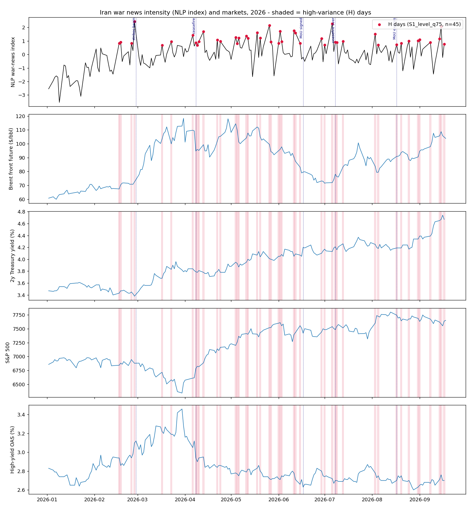
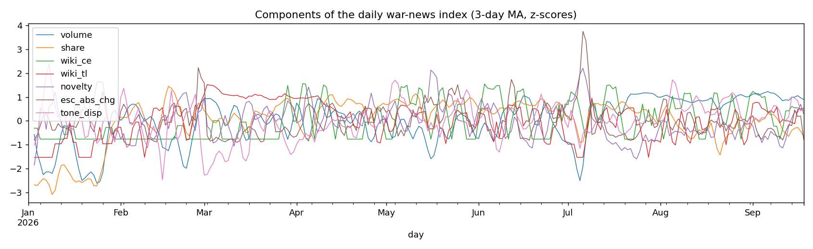
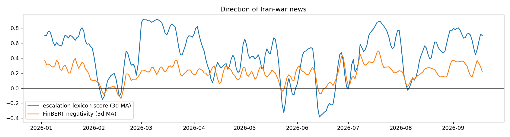

# Assignment 3 Report

### The Effects of Iran War Risk on Global Financial Markets in 2026: a replication of Rigobon and Sack (2003) with NLP-selected war-news days

FRE-GY 7871 A · NLP and the Investment Process · Fall 2026

<strong>Name:</strong> Yuri Moghaddam Nasrollahi 
<strong>NetID:</strong> ym3414 
<strong>GitHub repo:</strong> https://github.com/Yuri48/FinEng (folder <code>HW3</code>) 
<strong>Data as of:</strong> 20 September 2026 (market data 2 January to 17 September 2026, 179 US business days)

## 1. Summary

This report re-runs the heteroskedasticity-based estimator of Rigobon and Sack (2003), *The Effects of War Risk on U.S. Financial Markets*, on the 2026 Iran war. The paper's key idea is that the effect of an unobservable "war risk" factor on asset prices can be identified without measuring the factor itself: one only needs a set of days on which the *variance* of war news was elevated. Rigobon and Sack chose those 17 days by reading newspapers. Here the days are chosen by an NLP pipeline that scores 26,436 Iran-related headlines, the daily Wikipedia *Current events* pages, and the Wikipedia day-by-day timeline of the war, and the estimator is then applied to 29 US and global financial variables.

Main findings:

- **Identification works through oil, not through Treasury yields, in 2026.** In 2003 the two-year Treasury yield was the natural numeraire: its variance was six times higher on war-news days. In 2026 the variance of the two-year yield is *lower* on the NLP-selected war days than on neighbouring days (0.0019 vs 0.0033), so the paper's normalisation is not identified over the full sample. The variance of the Brent front-month future, by contrast, triples on war days (19.5 vs 6.4 $^2). The 2026 results are therefore reported for a war-risk increase large enough to raise Brent by $5 a barrel, with the paper's 25 bp-of-two-year-yield normalisation kept for the pre-war window, where it does hold.
- **Per $5 of war-driven Brent (baseline, 45 war days):** WTI +$5.1; S&P 500 -0.60%; Euro Stoxx 50 -1.2%; EM equities -1.3%; high-yield OAS +3.6 bp; BBB OAS +0.6 bp (marginal); 10-year yield +2.9 bp; 10-year break-even inflation +1.6 bp; broad dollar +0.20%; VIX +0.8 points; long Treasury ETF -0.29%; US airlines -2.5%; US energy stocks +1.5%; Henry Hub gas +1.4%. Gold, the yen, the Swiss franc, Bitcoin, the Nikkei, Tel Aviv 35 and the Saudi ETF show no significant response. All of the significant coefficients survive a tighter day cut-off (top 15%), the war/post-war sub-sample, and a hand-curated event list in the spirit of the paper's Table 1.
- **Compared with Iraq 2003, the sign of the yield and dollar responses flips.** In 2003 war risk pushed Treasury yields and break-even inflation *down* and the dollar *down* (flight into Treasuries, growth fears). In 2026 war risk pushed nominal yields and break-evens *up* and the dollar *up*: the Strait of Hormuz closure made the conflict an inflationary oil-supply shock, and the dollar behaved as a safe-haven/energy-exporter currency. Credit spreads widen and equities fall in both episodes, and gold is unresponsive in both.
- **Equities were far less sensitive per unit of oil than in 2003.** A 2003 war shock that raised oil by close to 3% cut the S&P 500 by 3.8%; a 2026 war shock that raises Brent by about 5% cuts it by 0.6%. The 2026 shock was priced mainly as a commodity and inflation shock rather than as a recession risk; the S&P 500 rose about 11% over the sample despite the war.
- **The war-risk factor explains a large share of variance on war days:** at least 66% for WTI, 51% for Euro Stoxx 50, 48% for airlines, 42% for energy stocks, 35% for the dollar, 30% for high-yield spreads, 26-27% for the S&P 500, the 10-year yield and break-even inflation. Over the whole 8.5-month sample the shares are smaller (3-14%), because war-news days are one quarter of the sample and many other shocks were at work.
- **Pre-war window (2 January to 27 February, 14 of 39 days):** the closest analogue to the 2003 setting. There the two-year yield variance does rise on war days and the paper's normalisation gives a high-yield spread response of +37 bp and a BBB response of +14 bp per 25 bp fall in the two-year yield, close to the paper's +34 bp and +5 bp; the 10-year yield, break-even, equity and oil responses have the 2003 signs but are not statistically significant with so few days.

## 2. Method

### 2.1 The estimator (Rigobon and Sack 2003, equations 1-12)

Daily changes in a pair of financial variables are written as a reduced form driven by common factors and idiosyncratic shocks, `dx = D z + eta`. The first factor `z1` is war risk; its loading on the first variable is normalised to one and its loading `d21` on the second variable is the object of interest. Nothing about `z1` is measured. Instead, one splits the sample into "war news" days H, on which the variance of `z1` is high, and nearby "other" days L. If only the variance of `z1` differs between the two sets, and `z1` is orthogonal to the other factors, then the change in the covariance matrix is `dOmega = Omega_H - Omega_L = dVar(z1) [1, d21; d21, d21^2]`, which gives two moment estimators, `d21 = dCov/dVar(x1)` (eq. 7) and `d21 = dVar(x2)/dCov` (eq. 6). Rigobon and Sack show these are IV estimators with instruments `nu1 = (+dx1 on H, -dx1 on L)` and `nu2 = (+dx2 on H, -dx2 on L)`; combining the two instruments gives the third estimator, which the paper prefers. `warrisk.py` implements all three with heteroskedasticity-robust standard errors, plus the variance decomposition of the paper's Table 3: variance on L and H days, the predicted change in variance `d21^2 dVar(x1)`, the share of H-day variance explained (a lower bound on the war-risk share) and the share over the whole window under serial independence. Changes are demeaned within regime. L days are chosen as in the paper: the nearest business day to each H day that is not itself an H day, without reuse, so that the two sets have equal size and are as close in time as possible.

The identification assumption that matters most in 2026 is `dVar(x1) > 0`: the variance of the numeraire variable must rise on war days. The tables report `dVar` for both numeraires and mark the variance decomposition as not identified when it fails.

### 2.2 Data

*Financial variables* (daily, 2 January to 17 September 2026): from FRED, the 2- and 10-year constant-maturity Treasury yields, 10-year break-even inflation, 10-year TIPS real yield, ICE BofA BBB and high-yield option-adjusted spreads, the Fed's broad trade-weighted dollar index and the VIX; from Yahoo Finance, S&P 500, Euro Stoxx 50, Nikkei 225, EEM (emerging markets), TA-35 (Israel), KSA (Saudi Arabia), ITA (US defense), JETS (US airlines), XLE (US energy), TLT (long Treasuries), HYG (high-yield bonds), BDRY (dry-bulk shipping), WTI and Brent front-month futures, gold and Henry Hub futures, DXY, EUR/USD, USD/JPY, USD/CHF and Bitcoin. Units follow the paper: percentage-point changes for yields and spreads, log-percentage changes for equities, currencies and ETFs, dollar changes for oil and gold. Changes are close-to-close on each series' own trading days and aligned to US business days (`market_data.py`).

*News corpora* (calendar days 1 January to 18 September 2026, `collect_news.py`, `wiki_timeline.py`): (i) Google News RSS headlines for two daily queries, a broad "Iran" query and a conflict query ("Iran war OR strikes OR missiles OR ceasefire OR Hormuz OR talks OR nuclear"), 26,436 unique headlines; (ii) the Wikipedia *Portal: Current events* page for every day, of which the Iran-related bullets are kept; (iii) the Wikipedia *Timeline of the 2026 Iran war*, split into its daily sections, extended back into January and February with dated sentences from the *Prelude*, *Negotiations* and *Oil market chronology* pages. GDELT's document API was rate-limited throughout and could not be used; the code handles it if it becomes available.

### 2.3 NLP pipeline (`nlp_pipeline.py`)

1. **Relevance filter.** A headline is relevant if it matches an Iran entity pattern (Iran, Tehran, IRGC, Khamenei, Hormuz, Houthi, Gulf states, Islamabad talks, ...) *and* a conflict/diplomacy pattern (war, strike, missile, blockade, ceasefire, talks, tanker, nuclear, sanctions, ...). 19,113 of the 26,436 headlines pass.
2. **Escalation lexicon.** Each relevant headline gets a score in [-1, 1] equal to (escalation terms - de-escalation terms)/(total), with 65 escalation terms (strike, missile, blockade, ultimatum, mines, sinks, expires, ...) and 49 de-escalation terms (ceasefire, deal, talks, memorandum, reopen, stand-down, corridor, ...). The daily mean gives the *direction* of the news; the absolute day-to-day change in the mean is a *surprise-in-direction* feature.
3. **FinBERT tone.** Every relevant headline is scored with ProsusAI/FinBERT (a BERT model fine-tuned for financial sentiment); tone = P(negative) - P(positive). The daily mean is a second direction measure and the cross-headline standard deviation measures *disagreement* in coverage, which is a natural proxy for the variance of news.
4. **Novelty.** Headlines of each day are pooled into one document, TF-IDF vectorised (unigrams and bigrams, stop-words removed), and novelty is one minus the cosine similarity to the centroid of the previous five days. Days that introduce new vocabulary (a new theatre, a new instrument such as a "toll" or a "blockade", a new actor) are days with new information.
5. **Volume.** Number of relevant headlines, the share of Iran coverage that is conflict-related, and the character counts of the Iran-related Wikipedia current-events bullets and of the war-timeline section for that day.
6. **Composite index and mapping to trading days.** The seven z-scored features (volume, share, current-events volume, timeline volume, novelty, escalation swing, tone dispersion) are averaged into a daily index. Calendar days are mapped to the next US trading day (weekend and holiday news is attributed to Monday). H days are the top quantile of the index; L days follow the paper's nearest-day rule.

Because the RSS feed returns at most 100 items per query, the headline count saturates during the sustained-combat weeks of March; on those weeks the composite index is driven by the novelty, direction-swing and dispersion features, which are lower when every day brings the same kind of news. The index therefore favours days on which the *state* of the conflict changed (strikes begin, ceasefire, blockade, deal, collapse) over days of steady bombardment. A volume-only index (specification S7) is reported to show what happens when the sustained-war weeks are selected instead.

### 2.4 Specifications

| Spec | Window | H days | Selection |
|---|---|---|---|
| S1 baseline | 2 Jan - 17 Sep | 45 of 179 | top 25% of the composite NLP index |
| S2 | same | 27 | top 15% |
| S3 | same | 45 | top 25% of the index relative to its trailing 10-day median (surprise) |
| S4 pre-war | 2 Jan - 27 Feb | 14 of 39 | top 36% (the paper's 17 of 47) |
| S5 war/post-war | 2 Mar - 16 Sep | 35 of 139 | top 25% |
| S6 curated | 2 Jan - 17 Sep | 49 | hand-collected event dates from the war timelines (the paper's method) |
| S7 volume | same | 45 | top 25% of a volume-only index |

Each specification is estimated twice: normalised to a war-risk increase that lowers the two-year yield by 25 bp (the paper), and to one that raises the Brent front-month future by $5.

## 3. Results

### 3.1 The NLP-selected war-news days

Figure 1 shows the composite index with the 45 baseline H days, against Brent, the two-year yield, the S&P 500 and the high-yield spread. The index is low and rising through January (protest crackdown, US naval build-up, on-off negotiations), spikes at the start of the strikes (27 February to 2 March), and then peaks at every change of state: the 8 April ceasefire and its collapse, the 13 April blockade, the May "deal or bombing" deadlines, the June Tomahawk exchanges and the 12-17 June memorandum, the 6-8 July tanker attacks that ended the ceasefire, the 17 August expiry of the memorandum, and the September tanker war. Table 1 lists each H day with its top headlines, the lexicon direction and the market moves of the day. The lexicon classifies 31 of the 45 days as risk-increasing, 12 as unclear and 2 as risk-decreasing; the lexicon is tilted toward escalation vocabulary, so several de-escalation days (12 and 15 June, 8 April) come out as "unclear" or "increased" because the headlines describe both the deal and the strikes that preceded it. The two clearly risk-decreasing days show the expected pattern: the two-year yield up, the S&P 500 up 1.1%, Brent down $3.6, high-yield spreads 6 bp tighter.

Seventeen of the 45 NLP days coincide with the 49 hand-curated event dates (12 would coincide by chance). The NLP set produces a sharper variance contrast than the curated set: the Brent variance ratio between H and L days is 3.1 for the NLP days and 2.2 for the curated days.

### 3.2 Which variable carries the war-risk factor?

The paper's Table 3 logic can be turned around to ask which variables become more volatile on war days. Variance ratios (H over L, baseline days): Brent 3.1, Euro Stoxx 50 2.7, airlines 2.3, energy stocks 2.3, high-yield OAS 1.5, break-even inflation 1.3, dollar 1.3, gold 1.3, S&P 500 1.1, two-year yield 0.57, ten-year yield 0.63, TIPS real yield 0.41, VIX 0.76. Treasury yields were *less* volatile on war days. Two forces cancel: war news raises inflation expectations (break-evens co-move with Brent with correlation +0.69 on H days) and at the same time triggers flight to safety; in 2003 only the second force was present. The correlations of daily changes with Brent are all much stronger on H days than on L days (S&P 500 -0.68 vs -0.34, dollar +0.69 vs +0.29, high-yield +0.55 vs +0.20, two-year yield +0.58 vs +0.36), which is exactly the pattern the identification exploits, with Brent as the variable that loads on war risk.

Consequently the two-year-yield normalisation is not identified over the full 2026 sample (negative `dVar`, unstable and insignificant coefficients in every full-sample specification; see the S1, S5, S6 tables), while the Brent normalisation is well identified and stable across specifications.

### 3.3 Sensitivities to war risk (Brent normalisation)

Table 2b reports the baseline. Per $5 of war-driven Brent (combined-instrument IV, |t| in parentheses): WTI +$5.14 (8.2); 10-year yield +2.9 bp (3.0); break-even inflation +1.6 bp (3.7); TIPS real yield +1.4 bp (1.4); S&P 500 -0.60% (3.7); Euro Stoxx 50 -1.20% (4.5); EEM -1.29% (3.4); Nikkei -0.6% (0.7); high-yield OAS +3.6 bp (2.7); BBB OAS +0.6 bp (1.7); HYG -0.19% (2.7); TLT -0.29% (2.2); broad dollar +0.20% (2.8); DXY +0.16% (2.7); EUR/USD -0.16% (1.2); USD/JPY and USD/CHF nil; gold -$4 (0.2); VIX +0.82 (2.1); airlines -2.5% (4.7); energy +1.5% (3.1); defense ETF -1.1% (2.7); natural gas +1.4% (2.3); shipping +0.7% (1.1); TA-35 +0.4% (1.0); KSA -0.45% (1.5); Bitcoin -0.4% (0.6).

Three of these deserve comment. First, the *defense* ETF falls with war risk, the opposite of the popular narrative; in 2026 defense stocks traded as high-multiple growth stocks and fell with the broad market, and the days with the most escalatory news were also days of talk about the fiscal cost of the war. Second, Europe and emerging markets are more sensitive than the US (Euro Stoxx -1.2% and EEM -1.3% against -0.6% for the S&P 500), consistent with their greater dependence on Gulf energy. Third, the dollar strengthens, which together with the rise in yields distinguishes 2026 from 2003: the US was a net energy exporter in 2026, and Treasury yields rose rather than fell.

The results are robust. With the top 15% of days (S2) the significant coefficients keep their signs and magnitudes (S&P 500 -0.47%, Euro Stoxx -0.82%, 10-year +3.5 bp, dollar +0.14%). Over the war and post-war window (S5) t-statistics rise (S&P 500 -0.61% with t = 4.6, Euro Stoxx -1.18% with t = 4.9, 10-year +3.0 bp with t = 3.7, break-even +1.7 bp with t = 4.5, high-yield +3.3 bp with t = 2.9, dollar +0.22% with t = 3.5). The hand-curated days (S6) give S&P 500 -0.70%, high-yield +4.6 bp, 10-year +2.6 bp, break-even +1.7 bp, Euro Stoxx -0.93%, airlines -1.9%, energy +1.0%, all significant, and a dollar response of +0.11% that is not. The surprise index (S3) yields weaker identification (Brent variance ratio 2.0) and only the oil-linked responses (WTI, airlines) remain significant: it is the *level* of war-news intensity, not its change relative to the recent past, that marks the high-variance days. The volume-only index (S7), which selects the sustained-combat weeks of March, gives a Brent variance ratio of only 1.8 and noisier estimates with the same signs (Euro Stoxx 50 -1.25% with t = 3.2, energy stocks +1.9% with t = 3.0, high-yield +5.1 bp with t = 2.0, S&P 500 -0.47% with t = 1.4): when every day is a war day, the nearest "other" days are war days too and the variance contrast that the estimator needs is diluted.

### 3.4 Variance decomposition

Table 3 for each specification reproduces the paper's Table 3. On baseline war days the war-risk factor accounts for at least 66% of the variance of WTI, 51% of Euro Stoxx 50, 48% of airlines, 42% of energy stocks, 35% of the broad dollar, 30% of high-yield spreads, 27% of the 10-year yield and of break-even inflation, 26% of the S&P 500, 23% of EEM and 22% of the VIX and the defense ETF, and essentially none of gold, the yen, the franc or Bitcoin. Over the full sample (179 days, 45 of them war days) the corresponding lower bounds are 14% for WTI, 9% for Euro Stoxx 50 and airlines, 7% for energy stocks, 3-4% for the S&P 500, the dollar, the 10-year yield, break-evens and high-yield spreads. The paper found 13-63% over ten weeks in which 17 of 47 days were war days; the 2026 sample is 3.8 times longer and contains other large shocks, so the smaller full-sample shares are expected.

### 3.5 The pre-war window and the two-year-yield normalisation

Between 2 January and 27 February the conflict was a *risk*, not a war, which is the paper's setting. The two-year yield variance rises on the 14 NLP-selected days (0.0017 vs 0.0011), so the paper's normalisation is identified. For a war-risk increase that lowers the two-year yield by 25 bp: 10-year yield -8 bp (0.4), break-even -10 bp (1.4), TIPS real yield -15 bp (1.5), S&P 500 -0.5% (0.1), BBB OAS +14 bp (2.1), high-yield OAS +37 bp (2.5), WTI -$0.4 (0.05), gold not identified, broad dollar -1.4% (0.7), Tel Aviv 35 -5.1% (1.3), airlines -15% (1.9), Bitcoin -33% (2.7). The credit-spread responses are strikingly close to 2003 (+34 bp high-yield, +5 bp BBB), and every point estimate for yields, equities and the dollar has the 2003 sign, but with 14 days the standard errors are large and the oil response, the hallmark of the later sample, is absent: in January and February oil moved with the news about talks (the -4% on 15 January, the -3% on 5 and 12 February, the +4% on 18 February) but its variance rose only by half on war days, so the pre-war identification runs through rates and credit rather than through oil.

### 3.6 Comparison with Iraq 2003

| | Iraq 2003 (per -25 bp two-year yield) | Iran 2026 (per +$5 Brent) | Sign |
|---|---|---|---|
| 10-year Treasury yield | -26 bp (11.9) | +2.9 bp (3.0) | flips |
| Break-even inflation | -11 bp (3.5) | +1.6 bp (3.7) | flips |
| S&P 500 | -3.76% (2.9) | -0.60% (3.7) | same |
| BBB spread | +5 bp (3.8) | +0.6 bp (1.7) | same |
| High-yield spread | +34 bp (5.4) | +3.6 bp (2.7) | same |
| Oil | +$0.77 12-month WTI (2.4) | +$5.14 front WTI (8.2) | same |
| Gold | +$1.3 (0.3) | -$4 (0.2) | none in both |
| Dollar (broad) | -0.44% (2.2) | +0.20% (2.8) | flips |

To put the two episodes on a common footing, scale each shock by the oil move it induces. The 2003 shock moved 12-month WTI by close to 3% of its price (about $0.77 on a $28 contract) and cut the S&P 500 by 3.8%; the 2026 shock moves Brent by about 5% ($5 on a $95 average price) and cuts the S&P 500 by 0.6%. Per percent of oil, US equities were roughly ten times more sensitive to war risk in 2003. The 2003 war risk was priced as a growth shock with a modest energy component (Iraq's output was small and the Gulf stayed open); the 2026 war risk was priced as an energy-supply and inflation shock (the Strait of Hormuz was closed or contested for most of the sample) with a small growth component. That is also why the sign of the yield, break-even and dollar responses flips: in 2003 investors bought Treasuries and sold dollars on war news; in 2026 they sold Treasuries on inflation fears and bought dollars.

## 4. Limitations

- **Timing.** News is attributed to the next US trading day by calendar date. Events after the US close on a weekday (the first strikes began around 18:30 ET on Friday 27 February) are attributed to that day rather than to the next trading day; Rigobon (2003, section IV) shows that misplacing some high-variance days lowers the variance contrast but does not bias the estimator as long as the H set still has higher war-news variance on average.
- **Headline volume is censored** at 100 items per query per day by the RSS feed, which mutes the volume component during March; the volume-only specification S7 documents the effect.
- **Sustained-war contamination of L days.** During March almost every day carried war news, so "nearest other days" are themselves war days. This works against finding a variance contrast and is one reason the composite index, which rewards changes of state, identifies better than raw volume.
- **The escalation lexicon is hand-built** and tilted toward escalation terms; it is used only to label the direction of H days (Table 1), not in the estimator.
- **FinBERT** was trained on financial phrase-bank sentences, not on war headlines; its tone is used only as a disagreement feature and a direction check.
- **Other factors are assumed homoskedastic** across H and L days. Nearest-day matching mitigates this, but 2026 also contained large monetary-policy and fiscal news; days on which those coincided with war news add noise to the two-year-yield results in particular.
- **GDELT** could not be pulled (rate-limited), so the index has no measure of global coverage share; the code uses it automatically when available.

## 5. Files

`README.md` describes the pipeline and `AI_USE.md` discloses the use of AI. Scripts: `market_data.py`, `collect_news.py`, `wiki_timeline.py`, `nlp_pipeline.py`, `warrisk.py`, `run_analysis.py`, `annotate_days.py`, `make_report.py`, `build_html.py`. Data: `data/`. Outputs: `output/table1_*.csv` (H days with headlines), `output/table2_*_ust2y.csv` and `output/table2_*_brent.csv` (all estimates and variance decompositions for every specification), `output/summary_across_specs_*.csv`, `output/H_days_*.csv`, `output/L_days_*.csv`, `output/index_trading_days.csv`, `output/fig/`.

## References

Rigobon, R. (2003). Identification through heteroskedasticity. *Review of Economics and Statistics* 85(4), 777-792.
Rigobon, R. and B. Sack (2003). The effects of war risk on U.S. financial markets. NBER Working Paper 9609.
Araci, D. (2019). FinBERT: Financial sentiment analysis with pre-trained language models (ProsusAI/finbert).

# Appendix: tables

## Table 1. NLP-selected high-variance war-news days (baseline S1)

Direction = sign of the escalation-lexicon score of that day's relevant headlines (>0.2 increased risk, <-0.2 decreased). Market columns are the day's changes: 2y yield (bp), S&P 500 (%), Brent front future ($), high-yield OAS (bp).

| date | index | risk_direction | d2y_bp | dSPX_pct | dBrent_usd | dHY_bp | headlines |
|---|---|---|---|---|---|---|---|
| 2026-02-17 | 0.82 | Unclear | 3 | 0.10 | -0.33 | 0 | Iran says 'guiding principles' agreed with US at nuclear talks | Iran says "clearer path ahead" to nuclear deal with U.S. after talks in Geneva under shadow of Trump's threats | Reza Pahlavi urges Trump to ditch Iran talks as US e |
| 2026-02-18 | 0.92 | Increased | 4 | 0.56 | 2.93 | -8 | President Trump warns of 'bad things' if Iran fails to make nuclear deal | Iran says ‘good progress’ made in nuclear talks with US in Geneva | Trump warns of 'bad things' if Iran doesn't make a deal, as U.S. carrier approaches reg |
| 2026-02-25 | 0.83 | Unclear | 2 | 0.81 | 0.08 | -3 | U.S. and Iran wrap up 'most intense' nuclear talks with no deal — more negotiations ahead | Iran threatens escalation if US attacks | US-Iran nuclear talks end without a deal as threat of war grows |
| 2026-02-27 | 2.44 | Increased | -4 | -0.43 | 1.73 | 12 | Attacks on Iran and retaliatory strikes ‘undermine international peace and security’ | Iranian leader Khamenei killed in air strikes as U.S., Israel launch attacks | Mapping US and Israeli attacks on Iran and Tehran’s retaliatory  |
| 2026-03-17 | 0.68 | Increased | 0 | 0.25 | 3.21 | -5 | Iran Launches Missile Attack on Tel Aviv in Retaliation for Latest Killings | Strikes hit world’s largest natural gas field in Iran, and Tehran retaliates with more attacks | Iran blames Israel for gas field attack, fires missiles |
| 2026-03-23 | 0.96 | Increased | -5 | 1.14 | -12.25 | -5 | Iran strikes near Israeli nuclear research center as Trump threatens attacks on Iranian power plants | Trump says Iran is eager for a deal to end the war as he extends deadline to allow for diplomacy | Iran attacks near Israeli nu |
| 2026-04-06 | 1.43 | Increased | 0 | 0.44 | 0.74 | -8 | Trump warns of "critical period" in Iran war, threatening severe strikes if there's no deal by Tuesday night | Iran updates: Pakistan seeks 2-week pause after Trump warns 'whole civilization will die' if no deal by deadline | Trum |
| 2026-04-08 | 0.88 | Increased | -2 | 2.48 | -14.52 | -18 | War on Iran during nuclear negotiations undermines the US’s ability to talk peace around the world − and the effects won’t end when Trump leaves office | Ceasefire is threatened as Israel expands Lebanon strikes and Iran closes st |
| 2026-04-09 | 0.69 | Increased | -1 | 0.62 | 1.17 | -4 | War on Iran during nuclear negotiations undermines the US’s ability to talk peace around the world − and the effects won’t end when Trump leaves office | Iran war ceasefire teeters over disagreements on Lebanon and the Strait of H |
| 2026-04-10 | 0.96 | Unclear | 3 | -0.11 | -0.72 | 4 | US and Iran end 21-hour ceasefire talks without agreement before Vance departs Pakistan | U.S. and Iran prepare for ceasefire talks as Netanyahu authorizes negotiations with Lebanon | How many people have been killed in the Iran w |
| 2026-04-13 | 1.70 | Unclear | -3 | 1.01 | 4.16 | 1 | Trump threatens Strait of Hormuz blockade after US-Iran ceasefire talks end without agreement | US begins blockade of Iran's ports, Tehran threatens retaliation | US military says it will blockade Iranian ports after ceasefire tal |
| 2026-04-22 | 1.07 | Increased | 1 | 1.04 | 3.43 | -1 | Iran says it has seized two ships in Strait of Hormuz after U.S. extends ceasefire | Iran fires on 3 ships in the Strait of Hormuz, complicating efforts to resume U.S. ceasefire talks | Trump extends ceasefire as uncertainty over  |
| 2026-04-24 | 0.97 | Increased | -5 | 0.79 | 0.26 | 0 | Latest ceasefire talks fail as Iran's top diplomat leaves Pakistan and Trump tells envoys not to go | Trump cancels US envoys' trip to Pakistan for talks on Iran war | Live Updates: Hopes for Peace Deal Rise After Iran Says Strait |
| 2026-05-04 | 1.27 | Increased | 7 | -0.41 | 6.27 | 1 | U.S. And Iran Fail to Agree on Peace Deal After 21 Hours of Talks, Vance Says | Markets on edge as fresh U.S.-Iran attacks dent optimism over a peace deal | US strikes Iranian fast boats as Iran attacks UAE oil facility |
| 2026-05-05 | 0.80 | Increased | -2 | 0.81 | -4.57 | -1 | Trump says Iran will be bombed at a 'much higher level' if it doesn't agree to peace deal | U.S. And Iran Fail to Agree on Peace Deal After 21 Hours of Talks, Vance Says | Markets on edge as fresh U.S.-Iran attacks dent optimism o |
| 2026-05-06 | 1.21 | Increased | -6 | 1.45 | -8.60 | -2 | Trump says Iran will be bombed at a 'much higher level' if it doesn't agree to peace deal | Trump declares US has won the war with Iran as nuclear deal negotiations continue | Iran War Updates: Tehran and U.S. Offer Conflicting Me |
| 2026-05-11 | 1.36 | Increased | 5 | 0.19 | 2.92 | -2 | Iran says US making ‘unreasonable’ demands in negotiations to end war | Iran warns the US against attacks on its oil tankers and other ships but ceasefire appears to hold | Israel is worried that Trump will strike a ‘bad deal’ wit |
| 2026-05-12 | 1.19 | Increased | 5 | -0.16 | 3.56 | 3 | Iran threatens to "teach a lesson" if U.S. attacks, Trump says ceasefire is "on life support" | Israel is worried that Trump will strike a ‘bad deal’ with Iran, leaving war objectives unmet | U.S. Might Restart Strikes on Iran, Tr |
| 2026-05-18 | 1.62 | Increased | -2 | -0.07 | 2.84 | 3 | Trump calls off scheduled attack on Iran amid "serious negotiations" toward peace deal | Iran war day 78: Trump, Tehran signal talks as Lebanon truce extended | U.A.E. reports drone strike at nuclear power plant as Iran war deadlo |
| 2026-05-20 | 1.21 | Increased | -9 | 1.07 | -6.26 | -6 | Iran Threatens to Strike Beyond the Middle East if the U.S. Resumes Attacks | Iran threatens to extend conflict ‘beyond the region’ if U.S. and Israel resume attacks | Iran threatens war ‘beyond the region’ if U.S. attacks |
| 2026-05-26 | 2.16 | Unclear | -12 | 0.61 | -3.96 | -2 | U.S. military strikes Iran as Trump says negotiations move forward for deal to end war | U.S. and Iran work toward deal to extend ceasefire and reopen Strait of Hormuz | US says it launched ‘self-defense strikes’ in Iran as peace  |
| 2026-05-27 | 0.93 | Unclear | -1 | 0.02 | -5.29 | -1 | Traders' hopes fade for U.S.-Iran nuclear deal this year despite report on potential ceasefire agreement | The Latest: Iran negotiators agree to extend ceasefire, begin nuclear talks pending Trump approval | U.S. and Iran Move Tow |
| 2026-06-01 | 0.83 | Unclear | 7 | 0.26 | 2.93 | -2 | Iran fires missiles and US strikes Iran facility after reports of faltering peace talks | U.S. bombs Iranian military sites and downs missiles Tehran fired at troops in Kuwait | US Bombs Iranian Military Sites, Then Downs Missiles |
| 2026-06-02 | 1.72 | Increased | 0 | 0.13 | 1.02 | -1 | Iran fires missiles and US strikes Iran facility after reports of faltering peace talks | Kuwait says Iranian drones hit airport and killed 1 as ceasefire is tested again | One killed and dozens injured in Iranian drone strikes on |
| 2026-06-03 | 0.95 | Increased | 3 | -0.74 | 1.81 | 4 | Kuwait says Iranian drones hit airport and killed 1 as ceasefire is tested again | One killed and dozens injured in Iranian drone strikes on Kuwait airport | Iranian drone attack kills Indian citizen in Kuwait after US strikes Qes |
| 2026-06-11 | 1.76 | Unclear | -8 | 1.74 | -2.72 | -2 | Iran war day 104: Iran attacks US bases, closes strait after Trump strikes | US and Iran have agreed to wording of a deal to end their war, Pakistan's prime minister says | Trump calls off latest threats to strike Iran, citing a b |
| 2026-06-12 | 1.60 | Decreased | 4 | 0.50 | -3.05 | -7 | Trump condemns Israeli strike in Beirut, warning attacks threaten deal on U.S-Iran war | US and Iran have agreed to wording of a deal to end their war, Pakistan's prime minister says | Trump calls off latest threats to strike Iran |
| 2026-06-15 | 0.83 | Decreased | -2 | 1.64 | -4.16 | -5 | Iran and US agree deal to open Strait of Hormuz and extend ceasefire | U.S. and Iran Reach Agreement to Reopen Strait and Begin Nuclear Talks | Trump condemns Israeli strike in Beirut, warning attacks threaten deal on U.S-Iran war |
| 2026-06-29 | 1.19 | Unclear | 3 | 1.17 | 1.16 | -3 | Iran attacks Bahrain and Kuwait following US strikes and threatens to halt talks to end the war | Iran attacks Bahrain and Kuwait following US strikes and threatens to halt talks | Iran attacks Bahrain and Kuwait following U.S. st |
| 2026-07-01 | 0.71 | Unclear | 3 | -0.22 | -1.35 | -1 | Iran Bans UN Nuclear Inspectors from Bombed Nuclear Sites after US-Israel Strikes | U.S. Military Strikes Missile and Drone Sites in Iran | As the Pentagon stays quiet, AP reconstructs a US strike that killed over 100 Iranian chil |
| 2026-07-06 | 2.28 | Increased | -1 | 0.72 | 0.19 | -2 | U.S. Strikes Iran and Reimposes Sanctions in Retaliation for Tanker Attacks | US Iran strikes today: US launches new strikes on Iran, revokes oil sales permit after 3 ships attacked in Strait of Hormuz | US launches new strikes on |
| 2026-07-08 | 0.91 | Increased | 2 | -0.28 | 3.86 | 3 | U.S. hits dozens of Iranian targets in retaliatory strikes after ship attacks in Strait of Hormuz | Iran fires 10 missiles at Jordan after US strikes reported near Bushehr nuclear plant | US Iran strikes today: US launches new str |
| 2026-07-09 | 0.89 | Increased | -5 | 0.81 | -1.72 | 0 | Iran fires 10 missiles at Jordan after US strikes reported near Bushehr nuclear plant | Iran Says U.S. Strikes Targeted Bushehr Nuclear Plant, Warns of Retaliation Against American Bases | US and Iran exchange intensifying fire ac |
| 2026-07-13 | 0.97 | Increased | 5 | -0.80 | 7.29 | 0 | U.S.-Iran strikes escalate over the Strait of Hormuz, threatening to collapse ceasefire | Trump resumes Iran port blockade and threatens strikes on energy targets | Iran launches missiles and drones at Gulf states after US strikes |
| 2026-08-03 | 1.50 | Unclear | -3 | 1.47 | -6.35 | -7 | Iran denies seeking halt to US attacks, agreement to reopen Strait of Hormuz | Trump threatens more strikes on Iran. Tensions from Hormuz to Kuwait and Gaza lead to more warnings | Iran threatens to strike other nations’ energy fi |
| 2026-08-05 | 0.71 | Unclear | -2 | -0.17 | 0.09 | 2 | Trump warns Iran will be hit 'really hard' if nuclear negotiations collapse again | Trump warns Iran will be hit ‘really hard’ if nuclear negotiations collapse again | EXCLUSIVE: Iran threatens to hit Gulf states if US launches ne |
| 2026-08-17 | 0.73 | Increased | 2 | -0.52 | 2.35 | 3 | As U.S.-Iran deadline for broad peace deal expires, Trump threatens to ‘bomb’ Oman | Iran threatens new offensive while US rules out extending ceasefire deal | Trump won't extend Iran ceasefire, threatens to 'bomb' Oman if it 'get |
| 2026-08-20 | 0.82 | Increased | 0 | -0.87 | 2.16 | 2 | Iran vows 'devastating' response as US threatens crushing sanctions designed to 'collapse' regime | US allies in Asia wary as Trump moves military assets for Iran war | Iran threatens military response to US sanctions |
| 2026-08-25 | 0.99 | Increased | -7 | 0.32 | -3.59 | 1 | Iran’s nuclear chief says attacked nuclear sites not secure for IAEA inspection | Can Trump's economic war against Iran do what airstrikes and negotiations couldn't? | Iran vows retaliation after U.S. widens sanctions, fueling fea |
| 2026-08-31 | 1.01 | Increased | 0 | -0.33 | 1.18 | 3 | Iran claims attacks on Bahrain, Jordan, Iraq after US strikes kill 11 | Iran fires on its Gulf neighbors, retaliating for US strikes after a wedding was hit | U.S. Attacks Island in Strait of Hormuz; Iran Retaliates With Missile F |
| 2026-09-01 | 1.11 | Increased | 5 | -0.71 | 4.16 | 2 | Iran claims attacks on Bahrain, Jordan, Iraq after US strikes kill 11 | Iran fires on U.S. allies in Gulf after night of American strikes it claims killed four at a wedding | Iran fires on its Gulf neighbors, retaliating for US st |
| 2026-09-08 | 0.90 | Increased | 2 | -0.59 | 1.64 | -1 | US military strikes three Iranian tankers in retaliation for missile attacks | Hormuz traffic slows after Iran threatens retaliation for US attacks | U.S. Hits 5 Iranian Oil Tankers, Citing Attempted Strikes on Warship |
| 2026-09-14 | 1.16 | Increased | 2 | -0.48 | 1.07 | 6 | Iran-backed Houthis claim to hit Saudi base with missiles, drones amid renewed fighting | Iraq probes drone strikes on Saudi Arabia, shuts three crossings to Iran | Iran hardliners said to have launched attacks in defiance of lead |
| 2026-09-15 | 2.07 | Increased | 2 | -0.45 | 3.07 | 5 | Saudi strikes and Houthi attacks widen Middle East war | New photos show widespread damage at U.S. positions caused by Iranian missile, drone attacks | Iran war cost hits $38 billion, forecast to rise $3 billion a month, CBO says |
| 2026-09-17 | 0.77 | Increased | -7 | 1.13 | -1.01 | 0 | Iran in, Abbas out: Trump threatens new strikes as US grants Tehran leaders UN visas | Houthi media says Saudi strikes kill one, hit telecom towers in Yemen | US approves visas for top Iranian leaders to attend UN high-level meeti |

## Table 2 (S1_level_q75). Estimated impact of an increase in war risk, normalised to a 25 bp drop in the two-year Treasury yield

S1 baseline: full sample, top-25% NLP index, nearest-day L. Window 2026-01-02 to 2026-09-17; nH = 45, nL = 45. Two-year yield variance: L days 0.00334, H days 0.00190. Absolute t-statistics (heteroskedasticity-robust) in parentheses.

| Variable | Units | IV with nu1 | IV with nu2 | IV with nu3 |
|---|---|---|---|---|
| Ten-year Treasury yield | pp chg | -0.143 (1.83) | -0.333 (2.17) | -0.0667 (0.88) |
| 10y break-even inflation | pp chg | 0.111 (0.87) | -0.0738 (0.88) | 0.0177 (0.44) |
| S&P 500 | pct chg | 1.59 (0.84) | 2.72 (0.37) | 1.5 (0.87) |
| BBB corporate OAS | pp chg | 0.0454 (1.40) | -0.0483 (0.55) | 0.00957 (0.28) |
| High-yield corporate OAS | pp chg | 0.219 (1.15) | -0.2 (0.73) | 0.00993 (0.07) |
| WTI front-month future | $ chg | 15.3 (0.74) | -60.6 (1.67) | -17 (1.19) |
| Gold future | $ chg | 231 (1.14) | -303 (0.50) | 117 (0.70) |
| Broad trade-weighted dollar | pct chg | -0.658 (1.32) | 0.79 (0.25) | -0.616 (1.23) |
| 10y TIPS real yield | pp chg | -0.254 (2.37) | -0.252 (3.84) | -0.252 (3.89) |
| Brent front-month future | $ chg | 16.2 (0.76) | -52.7 (2.09) | -15.3 (1.43) |
| DXY dollar index | pct chg | -1.53 (1.91) | -1.64 (1.88) | -1.59 (2.22) |
| EUR/USD | pct chg | -0.475 (0.64) | 0.645 (0.09) | -0.445 (0.59) |
| USD/JPY | pct chg | -0.101 (0.11) | -91.1 (0.10) | -0.432 (0.42) |
| USD/CHF | pct chg | 0.201 (0.23) | 5.83 (0.15) | 0.168 (0.19) |
| VIX | pt chg | -3.54 (0.84) | -9.88 (0.86) | -3.97 (0.87) |
| 20y+ Treasury ETF (TLT) | pct chg | 0.0299 (0.02) | 258 (0.02) | -1.6 (0.87) |
| HY bond ETF (HYG) | pct chg | -0.118 (0.11) | 22.1 (0.13) | 1.11 (1.94) |
| Euro Stoxx 50 | pct chg | -4.73 (0.86) | 12.6 (1.63) | 3.32 (0.89) |
| Nikkei 225 | pct chg | -1.58 (0.51) | -23.3 (0.42) | -1.85 (0.57) |
| EM equities (EEM) | pct chg | 0.897 (0.16) | -5.95 (0.04) | 1.23 (0.38) |
| Tel Aviv 35 | pct chg | 1.15 (0.31) | -34 (0.25) | 0.439 (0.11) |
| Saudi equities (KSA ETF) | pct chg | -1.01 (0.32) | 18.2 (0.45) | 0.703 (0.31) |
| US defense ETF (ITA) | pct chg | -3.11 (0.51) | 16.1 (0.96) | 0.899 (0.29) |
| US airlines ETF (JETS) | pct chg | -10.7 (0.76) | 23.1 (2.32) | 5.59 (1.29) |
| US energy ETF (XLE) | pct chg | 12 (0.98) | -9 (2.44) | -2.2 (0.82) |
| Henry Hub natgas future | pct chg | 10.6 (0.96) | -8.54 (0.54) | 2.89 (0.46) |
| Dry-bulk shipping ETF (BDRY) | pct chg | 6.48 (0.76) | -35 (1.02) | -3.64 (0.51) |
| Bitcoin | pct chg | 12.5 (1.45) | -6.86 (0.51) | 2.19 (0.31) |

### Table 3 (S1_level_q75). Variances and share explained by the war-risk factor

| Variable | Var. on L days | Var. on H days | Predicted change in var. | % explained, H days | % explained, all days |
|---|---|---|---|---|---|
| Ten-year Treasury yield | 0.002573 | 0.001624 | -0.0001021 |  |  |
| 10y break-even inflation | 0.0003911 | 0.00052 | -7.161e-06 |  |  |
| S&P 500 | 0.6766 | 0.7196 | -0.05225 |  |  |
| BBB corporate OAS | 9.556e-05 | 0.00014 | -2.105e-06 |  |  |
| High-yield corporate OAS | 0.001522 | 0.002271 | -2.263e-06 |  |  |
| WTI front-month future | 6.762 | 20.98 | -6.751 |  |  |
| Gold future | 3901 | 4872 | -316.8 |  |  |
| Broad trade-weighted dollar | 0.05291 | 0.06738 | -0.008505 |  |  |
| 10y TIPS real yield | 0.002027 | 0.0008289 | -0.001457 |  |  |
| Brent front-month future | 6.383 | 19.52 | -5.434 |  |  |
| DXY dollar index | 0.1103 | 0.06787 | -0.05857 |  |  |
| EUR/USD | 0.1107 | 0.1152 | -0.004557 |  |  |
| USD/JPY | 0.382 | 0.2325 | -0.004279 |  |  |
| USD/CHF | 0.195 | 0.1764 | -0.0006492 |  |  |
| VIX | 2.082 | 1.577 | -0.3673 |  |  |
| 20y+ Treasury ETF (TLT) | 0.436 | 0.3004 | -0.05973 |  |  |
| HY bond ETF (HYG) | 0.06618 | 0.1025 | -0.02887 |  |  |
| Euro Stoxx 50 | 0.5974 | 1.59 | -0.2746 |  |  |
| Nikkei 225 | 3.337 | 2.955 | -0.07716 |  |  |
| EM equities (EEM) | 3.312 | 3.787 | -0.03518 |  |  |
| Tel Aviv 35 | 1.157 | 1.626 | -0.004299 |  |  |
| Saudi equities (KSA ETF) | 0.863 | 1.088 | -0.01149 |  |  |
| US defense ETF (ITA) | 2.18 | 2.914 | -0.01881 |  |  |
| US airlines ETF (JETS) | 3.059 | 6.953 | -0.7265 |  |  |
| US energy ETF (XLE) | 1.296 | 2.925 | -0.113 |  |  |
| Henry Hub natgas future | 5.884 | 7.728 | -0.195 |  |  |
| Dry-bulk shipping ETF (BDRY) | 3.615 | 6.873 | -0.3091 |  |  |
| Bitcoin | 4.821 | 6.185 | -0.1107 |  |  |

## Table 2 (S4_prewar). Estimated impact of an increase in war risk, normalised to a 25 bp drop in the two-year Treasury yield

S4 pre-war window (2 Jan - 27 Feb): top-36% NLP index, as in the paper's 17/47 design. Window 2026-01-02 to 2026-02-27; nH = 14, nL = 14. Two-year yield variance: L days 0.00110, H days 0.00174. Absolute t-statistics (heteroskedasticity-robust) in parentheses.

| Variable | Units | IV with nu1 | IV with nu2 | IV with nu3 |
|---|---|---|---|---|
| Ten-year Treasury yield | pp chg | -0.241 (1.51) | 0.0576 (0.14) | -0.0844 (0.39) |
| 10y break-even inflation | pp chg | -0.124 (0.91) | -0.0845 (0.82) | -0.102 (1.39) |
| S&P 500 | pct chg | -9.19 (0.83) | 0.681 (0.12) | -0.482 (0.10) |
| BBB corporate OAS | pp chg | 0.12 (0.79) | 0.148 (2.59) | 0.143 (2.14) |
| High-yield corporate OAS | pp chg | 0.726 (0.93) | 0.431 (3.11) | 0.369 (2.50) |
| WTI front-month future | $ chg | -0.684 (0.07) | -92.2 (0.07) | -0.449 (0.05) |
| Gold future | $ chg | 761 (0.53) | -4.38e+03 (0.95) | -1.14e+03 (0.64) |
| Broad trade-weighted dollar | pct chg | -1.09 (0.46) | -2.59 (0.58) | -1.43 (0.67) |
| 10y TIPS real yield | pp chg | -0.116 (1.34) | 0.431 (0.39) | -0.146 (1.50) |
| Brent front-month future | $ chg | -0.0747 (0.01) | -1.77e+03 (0.01) | 0.591 (0.05) |
| DXY dollar index | pct chg | -1.88 (0.57) | 2.35 (0.31) | -0.765 (0.32) |
| EUR/USD | pct chg | 5.63 (0.65) | 0.0791 (0.03) | 1.12 (0.51) |
| USD/JPY | pct chg | -6.5 (0.54) | -7.09 (1.12) | -6.9 (1.81) |
| USD/CHF | pct chg | -6.34 (0.64) | 1.93 (0.35) | -0.548 (0.14) |
| VIX | pt chg | 18.5 (0.87) | 3.83 (0.45) | 3.55 (0.41) |
| 20y+ Treasury ETF (TLT) | pct chg | 2.93 (1.41) | -6.39 (0.41) | 1.42 (0.50) |
| HY bond ETF (HYG) | pct chg | -0.982 (0.54) | -1.73 (0.57) | -1.32 (1.12) |
| Euro Stoxx 50 | pct chg | -10.1 (0.80) | -1.88 (0.81) | -1.82 (0.78) |
| Nikkei 225 | pct chg | 1.1 (0.21) | 43.4 (0.21) | 2.12 (0.39) |
| EM equities (EEM) | pct chg | -4.57 (0.81) | 12 (0.41) | -2.27 (0.43) |
| Tel Aviv 35 | pct chg | -10.1 (0.77) | -3.42 (0.64) | -5.07 (1.34) |
| Saudi equities (KSA ETF) | pct chg | -5.05 (0.66) | -19.3 (0.97) | -10.1 (0.99) |
| US defense ETF (ITA) | pct chg | -19.1 (0.64) | 3.2 (0.52) | -0.62 (0.12) |
| US airlines ETF (JETS) | pct chg | -34.3 (0.66) | -13.3 (1.43) | -15 (1.86) |
| US energy ETF (XLE) | pct chg | 7.23 (0.42) | -4.4 (0.35) | 1.96 (0.34) |
| Henry Hub natgas future | pct chg | 152 (0.66) | -189 (0.92) | -76.7 (0.50) |
| Dry-bulk shipping ETF (BDRY) | pct chg | 8.14 (0.42) | -45.2 (0.42) | 0.787 (0.05) |
| Bitcoin | pct chg | -82.5 (0.77) | -34.2 (2.95) | -33 (2.66) |

### Table 3 (S4_prewar). Variances and share explained by the war-risk factor

| Variable | Var. on L days | Var. on H days | Predicted change in var. | % explained, H days | % explained, all days |
|---|---|---|---|---|---|
| Ten-year Treasury yield | 0.001321 | 0.001371 | 7.246e-05 | 5.283 | 2.833 |
| 10y break-even inflation | 0.0002571 | 0.0003714 | 0.0001067 | 28.71 | 17.93 |
| S&P 500 | 0.7419 | 0.6638 | 0.002363 | 0.3561 | 0.2037 |
| BBB corporate OAS | 9.286e-05 | 0.0002786 | 0.0002077 | 74.55 | 62.95 |
| High-yield corporate OAS | 0.001843 | 0.004329 | 0.001383 | 31.94 | 26.86 |
| WTI front-month future | 1.649 | 1.952 | 0.002047 | 0.1049 | 0.05346 |
| Gold future | 3.865e+04 | 7728 | 1.331e+04 | 172.2 | 35.96 |
| Broad trade-weighted dollar | 0.06852 | 0.08994 | 0.0209 | 23.24 | 16.23 |
| 10y TIPS real yield | 0.0009929 | 0.0006143 | 0.0002167 | 35.28 | 14.06 |
| Brent front-month future | 1.817 | 2.7 | 0.003557 | 0.1318 | 0.07871 |
| DXY dollar index | 0.2011 | 0.1473 | 0.005955 | 4.044 | 2.068 |
| EUR/USD | 0.2281 | 0.2272 | 0.01281 | 5.639 | 3.387 |
| USD/JPY | 0.2945 | 0.7054 | 0.4846 | 68.7 | 57.4 |
| USD/CHF | 0.5134 | 0.3834 | 0.003052 | 0.7959 | 0.4114 |
| VIX | 2.113 | 2.764 | 0.1282 | 4.639 | 3.269 |
| 20y+ Treasury ETF (TLT) | 0.4153 | 0.2902 | 0.02061 | 7.1 | 3.175 |
| HY bond ETF (HYG) | 0.01672 | 0.03235 | 0.01785 | 55.18 | 42.57 |
| Euro Stoxx 50 | 0.3801 | 0.6757 | 0.03356 | 4.967 | 2.537 |
| Nikkei 225 | 1.756 | 2.582 | 0.06236 | 2.416 | 0.9384 |
| EM equities (EEM) | 1.622 | 1.14 | 0.05246 | 4.6 | 1.867 |
| Tel Aviv 35 | 0.7174 | 1.113 | 0.261 | 23.46 | 11.36 |
| Saudi equities (KSA ETF) | 0.4958 | 1.469 | 1.037 | 70.57 | 35.12 |
| US defense ETF (ITA) | 2.002 | 1.433 | 0.003912 | 0.2731 | 0.09096 |
| US airlines ETF (JETS) | 3.282 | 7.47 | 2.296 | 30.73 | 24.88 |
| US energy ETF (XLE) | 2.508 | 1.314 | 0.03914 | 2.98 | 0.7899 |
| Henry Hub natgas future | 385.9 | 120.7 | 59.87 | 49.62 | 15.05 |
| Dry-bulk shipping ETF (BDRY) | 8.431 | 4.914 | 0.006293 | 0.1281 | 0.04096 |
| Bitcoin | 7.523 | 32.5 | 11.08 | 34.1 | 34.09 |

## Table 2 (S5_warpost). Estimated impact of an increase in war risk, normalised to a 25 bp drop in the two-year Treasury yield

S5 war and post-war window (2 Mar - 16 Sep). Window 2026-03-02 to 2026-09-16; nH = 35, nL = 35. Two-year yield variance: L days 0.00343, H days 0.00212. Absolute t-statistics (heteroskedasticity-robust) in parentheses.

| Variable | Units | IV with nu1 | IV with nu2 | IV with nu3 |
|---|---|---|---|---|
| Ten-year Treasury yield | pp chg | -0.0636 (0.32) | -0.676 (0.36) | 0.0903 (0.35) |
| 10y break-even inflation | pp chg | 0.302 (0.59) | -0.0742 (1.20) | -0.00303 (0.06) |
| S&P 500 | pct chg | 0.867 (0.22) | -2.91 (0.06) | 1.21 (0.40) |
| BBB corporate OAS | pp chg | 0.0635 (0.73) | 0.0189 (0.31) | 0.0333 (0.83) |
| High-yield corporate OAS | pp chg | 0.488 (0.64) | -0.0799 (0.38) | 0.0124 (0.07) |
| WTI front-month future | $ chg | 48.8 (0.54) | -43.6 (2.21) | -22.6 (1.37) |
| Gold future | $ chg | 382 (0.70) | -16.6 (0.03) | 135 (0.43) |
| Broad trade-weighted dollar | pct chg | -1.41 (0.80) | 1.2 (0.33) | 0.0876 (0.04) |
| 10y TIPS real yield | pp chg | -0.365 (0.97) | -0.325 (2.79) | -0.312 (3.55) |
| Brent front-month future | $ chg | 46.9 (0.54) | -42.6 (2.92) | -21.7 (1.73) |
| DXY dollar index | pct chg | -2.94 (0.84) | -1.84 (2.07) | -1.68 (1.77) |
| EUR/USD | pct chg | -0.397 (0.30) | 4.85 (0.21) | -0.261 (0.20) |
| USD/JPY | pct chg | -0.755 (0.33) | -25.9 (0.36) | -2.59 (0.58) |
| USD/CHF | pct chg | 0.372 (0.23) | 4.07 (0.10) | 0.394 (0.25) |
| VIX | pt chg | -4.11 (0.50) | -13.6 (0.65) | -5.25 (0.57) |
| 20y+ Treasury ETF (TLT) | pct chg | -2.19 (0.36) | -5.38 (0.34) | -3.5 (0.90) |
| HY bond ETF (HYG) | pct chg | -1.16 (0.32) | 4.25 (1.05) | 1.12 (1.35) |
| Euro Stoxx 50 | pct chg | -11.8 (0.53) | 11.3 (1.80) | 5.75 (1.08) |
| Nikkei 225 | pct chg | -2.77 (0.45) | -31.9 (0.46) | -4.18 (0.58) |
| EM equities (EEM) | pct chg | -4.7 (0.27) | 9.34 (0.42) | -0.638 (0.11) |
| Tel Aviv 35 | pct chg | 4.83 (0.40) | -11 (0.29) | -0.899 (0.07) |
| Saudi equities (KSA ETF) | pct chg | -3.7 (0.40) | 21.7 (0.96) | 6.27 (0.86) |
| US defense ETF (ITA) | pct chg | -13.8 (0.50) | 11.6 (1.72) | 2.89 (0.59) |
| US airlines ETF (JETS) | pct chg | -30.9 (0.52) | 17.4 (3.72) | 6.66 (1.64) |
| US energy ETF (XLE) | pct chg | 23.3 (0.55) | -8.36 (2.25) | -2.7 (0.81) |
| Henry Hub natgas future | pct chg | 36.7 (0.61) | -6.19 (0.71) | -1.19 (0.15) |
| Dry-bulk shipping ETF (BDRY) | pct chg | 11.3 (0.47) | -36.2 (0.90) | -11 (0.62) |
| Bitcoin | pct chg | 14.2 (0.75) | -7.82 (0.33) | 0.338 (0.02) |

### Table 3 (S5_warpost). Variances and share explained by the war-risk factor

| Variable | Var. on L days | Var. on H days | Predicted change in var. | % explained, H days | % explained, all days |
|---|---|---|---|---|---|
| Ten-year Treasury yield | 0.002357 | 0.001709 | -0.0001706 |  |  |
| 10y break-even inflation | 0.0003743 | 0.0005886 | -1.92e-07 |  |  |
| S&P 500 | 0.6864 | 0.8328 | -0.03123 |  |  |
| BBB corporate OAS | 9.714e-05 | 9.429e-05 | -2.319e-05 |  |  |
| High-yield corporate OAS | 0.001709 | 0.002143 | -3.194e-06 |  |  |
| WTI front-month future | 5.989 | 25.91 | -10.89 |  |  |
| Gold future | 4372 | 4430 | -388.1 |  |  |
| Broad trade-weighted dollar | 0.05849 | 0.07958 | -0.0001425 |  |  |
| 10y TIPS real yield | 0.002137 | 0.0007486 | -0.002043 |  |  |
| Brent front-month future | 5.547 | 24.19 | -10.11 |  |  |
| DXY dollar index | 0.1234 | 0.06836 | -0.06059 |  |  |
| EUR/USD | 0.1046 | 0.1213 | -0.001426 |  |  |
| USD/JPY | 0.4538 | 0.2531 | -0.1407 |  |  |
| USD/CHF | 0.223 | 0.2043 | -0.003245 |  |  |
| VIX | 2.161 | 1.581 | -0.5881 |  |  |
| 20y+ Treasury ETF (TLT) | 0.4047 | 0.2788 | -0.2613 |  |  |
| HY bond ETF (HYG) | 0.07269 | 0.1127 | -0.02683 |  |  |
| Euro Stoxx 50 | 0.6256 | 1.909 | -0.7807 |  |  |
| Nikkei 225 | 4.052 | 3.239 | -0.3489 |  |  |
| EM equities (EEM) | 3.559 | 4.444 | -0.008709 |  |  |
| Tel Aviv 35 | 1.382 | 1.69 | -0.01622 |  |  |
| Saudi equities (KSA ETF) | 0.6294 | 1.323 | -0.8401 |  |  |
| US defense ETF (ITA) | 2.279 | 3.594 | -0.178 |  |  |
| US airlines ETF (JETS) | 2.877 | 7.932 | -0.947 |  |  |
| US energy ETF (XLE) | 1.525 | 3.291 | -0.156 |  |  |
| Henry Hub natgas future | 5.765 | 8.209 | -0.03009 |  |  |
| Dry-bulk shipping ETF (BDRY) | 4.034 | 7.765 | -2.59 |  |  |
| Bitcoin | 5.105 | 6.158 | -0.002389 |  |  |

## Table 2 (S6_curated). Estimated impact of an increase in war risk, normalised to a 25 bp drop in the two-year Treasury yield

S6 hand-curated event days (the paper's 'reading newspapers' approach). Window 2026-01-02 to 2026-09-17; nH = 49, nL = 49. Two-year yield variance: L days 0.00296, H days 0.00266. Absolute t-statistics (heteroskedasticity-robust) in parentheses.

| Variable | Units | IV with nu1 | IV with nu2 | IV with nu3 |
|---|---|---|---|---|
| Ten-year Treasury yield | pp chg | -0.0889 (0.26) | 0.27 (0.08) | -0.211 (0.65) |
| 10y break-even inflation | pp chg | 0.161 (0.27) | -0.214 (0.70) | -0.0798 (0.40) |
| S&P 500 | pct chg | 5.35 (0.39) | -7.27 (0.35) | -3.11 (0.22) |
| BBB corporate OAS | pp chg | -0.0493 (0.24) | 0.291 (0.45) | 0.0971 (0.40) |
| High-yield corporate OAS | pp chg | -0.229 (0.24) | 1.61 (0.52) | 0.632 (0.53) |
| WTI front-month future | $ chg | 34.3 (0.28) | -77.9 (1.21) | -44.6 (1.00) |
| Gold future | $ chg | 934 (0.35) | -1.11e+03 (0.70) | -768 (0.54) |
| Broad trade-weighted dollar | pct chg | -2.1 (0.14) | 2.53 (0.16) | 1.35 (0.11) |
| 10y TIPS real yield | pp chg | -0.25 (0.65) | -0.254 (1.17) | -0.255 (1.20) |
| Brent front-month future | $ chg | 27.2 (0.26) | -90 (0.96) | -45.6 (0.88) |
| DXY dollar index | pct chg | 0.37 (0.09) | -20.5 (0.12) | -2.24 (0.47) |
| EUR/USD | pct chg | -3 (0.33) | 0.398 (0.10) | -0.382 (0.13) |
| USD/JPY | pct chg | 3.98 (0.32) | 8.89 (0.84) | 7.48 (0.90) |
| USD/CHF | pct chg | 3.03 (0.35) | 5.42 (0.65) | 4.71 (0.72) |
| VIX | pt chg | -16.4 (0.37) | 6.17 (0.31) | 3.05 (0.17) |
| 20y+ Treasury ETF (TLT) | pct chg | 1.14 (0.23) | -24.3 (0.15) | 3.71 (0.38) |
| HY bond ETF (HYG) | pct chg | 0.33 (0.13) | -16.8 (0.10) | 2.12 (0.45) |
| Euro Stoxx 50 | pct chg | -2.81 (0.21) | 27.1 (0.35) | 4.52 (0.30) |
| Nikkei 225 | pct chg | 69.4 (0.05) | 12.7 (0.37) | 14.3 (0.43) |
| EM equities (EEM) | pct chg | 2.57 (0.13) | 118 (0.13) | 1.35 (0.07) |
| Tel Aviv 35 | pct chg | 4.87 (0.25) | -38.9 (0.39) | -14.2 (0.32) |
| Saudi equities (KSA ETF) | pct chg | 5.95 (0.35) | -16.3 (0.49) | -8.15 (0.37) |
| US defense ETF (ITA) | pct chg | 21 (0.34) | -6.23 (0.57) | -5 (0.47) |
| US airlines ETF (JETS) | pct chg | 26.9 (0.37) | -7.96 (0.48) | -7.81 (0.47) |
| US energy ETF (XLE) | pct chg | 12.5 (0.31) | -9.51 (0.81) | -3.55 (0.38) |
| Henry Hub natgas future | pct chg | -80 (0.33) | -160 (1.07) | -147 (1.01) |
| Dry-bulk shipping ETF (BDRY) | pct chg | 0.584 (0.03) | -247 (0.03) | 0.426 (0.02) |
| Bitcoin | pct chg | 26.8 (0.32) | -13.8 (0.45) | -5.26 (0.20) |

### Table 3 (S6_curated). Variances and share explained by the war-risk factor

| Variable | Var. on L days | Var. on H days | Predicted change in var. | % explained, H days | % explained, all days |
|---|---|---|---|---|---|
| Ten-year Treasury yield | 0.002 | 0.002149 | -0.0002138 |  |  |
| 10y break-even inflation | 0.0004184 | 0.0005898 | -3.055e-05 |  |  |
| S&P 500 | 0.6788 | 0.8689 | -0.04647 |  |  |
| BBB corporate OAS | 0.0001122 | 0.0001837 | -4.53e-05 |  |  |
| High-yield corporate OAS | 0.001751 | 0.003588 | -0.001916 |  |  |
| WTI front-month future | 9.13 | 22.62 | -9.532 |  |  |
| Gold future | 6951 | 1.274e+04 | -2828 |  |  |
| Broad trade-weighted dollar | 0.0846 | 0.09528 | -0.003535 |  |  |
| 10y TIPS real yield | 0.001537 | 0.001233 | -0.0003116 |  |  |
| Brent front-month future | 9.978 | 22.4 | -9.979 |  |  |
| DXY dollar index | 0.09706 | 0.1382 | -0.02417 |  |  |
| EUR/USD | 0.124 | 0.1374 | -0.0007019 |  |  |
| USD/JPY | 0.384 | 0.2094 | -0.2687 |  |  |
| USD/CHF | 0.2293 | 0.165 | -0.1064 |  |  |
| VIX | 2.751 | 3.286 | -0.04477 |  |  |
| 20y+ Treasury ETF (TLT) | 0.3403 | 0.4865 | -0.0661 |  |  |
| HY bond ETF (HYG) | 0.06662 | 0.09475 | -0.02165 |  |  |
| Euro Stoxx 50 | 1.117 | 1.499 | -0.09813 |  |  |
| Nikkei 225 | 4.722 | 4.003 | -0.05971 |  |  |
| EM equities (EEM) | 4.654 | 3.086 | -0.008691 |  |  |
| Tel Aviv 35 | 0.9761 | 1.749 | -0.9795 |  |  |
| Saudi equities (KSA ETF) | 0.7575 | 1.236 | -0.3186 |  |  |
| US defense ETF (ITA) | 2.048 | 2.685 | -0.1201 |  |  |
| US airlines ETF (JETS) | 4.437 | 5.51 | -0.2929 |  |  |
| US energy ETF (XLE) | 1.776 | 2.342 | -0.06062 |  |  |
| Henry Hub natgas future | 93.51 | 26.71 | -103.9 |  |  |
| Dry-bulk shipping ETF (BDRY) | 6.868 | 7.205 | -0.0008696 |  |  |
| Bitcoin | 8.017 | 9.854 | -0.133 |  |  |

## Table 2 (S3_surprise_q75). Estimated impact of an increase in war risk, normalised to a 25 bp drop in the two-year Treasury yield

S3 surprise index (intensity relative to the trailing 10-day median). Window 2026-01-02 to 2026-09-17; nH = 45, nL = 45. Two-year yield variance: L days 0.00293, H days 0.00218. Absolute t-statistics (heteroskedasticity-robust) in parentheses.

| Variable | Units | IV with nu1 | IV with nu2 | IV with nu3 |
|---|---|---|---|---|
| Ten-year Treasury yield | pp chg | -0.278 (1.30) | -0.374 (2.10) | -0.374 (2.10) |
| 10y break-even inflation | pp chg | 0.0846 (0.37) | -0.128 (0.62) | -0.00204 (0.02) |
| S&P 500 | pct chg | 4.59 (0.60) | 2.72 (0.41) | 3.48 (1.08) |
| BBB corporate OAS | pp chg | 0.0305 (0.50) | -0.0335 (0.12) | 0.0248 (0.42) |
| High-yield corporate OAS | pp chg | -0.0399 (0.13) | 5.58 (0.15) | 0.339 (0.61) |
| WTI front-month future | $ chg | 1.56 (0.07) | -472 (0.08) | -23.1 (0.70) |
| Gold future | $ chg | 597 (0.67) | -1.55e+03 (0.70) | -660 (0.48) |
| Broad trade-weighted dollar | pct chg | -1.09 (0.77) | 1.56 (0.46) | -0.0795 (0.06) |
| 10y TIPS real yield | pp chg | -0.362 (0.97) | -0.249 (2.53) | -0.222 (1.88) |
| Brent front-month future | $ chg | 2.24 (0.10) | -433 (0.11) | -27.5 (0.73) |
| DXY dollar index | pct chg | -1.12 (0.71) | 2.77 (0.34) | -0.485 (0.30) |
| EUR/USD | pct chg | -0.836 (0.40) | -1.03 (0.12) | -0.859 (0.43) |
| USD/JPY | pct chg | 0.363 (0.14) | -4.18 (0.06) | 0.307 (0.12) |
| USD/CHF | pct chg | -0.16 (0.07) | 4.71 (0.04) | -0.118 (0.05) |
| VIX | pt chg | -10.5 (0.56) | 0.95 (0.10) | -2.18 (0.34) |
| 20y+ Treasury ETF (TLT) | pct chg | 2.07 (0.75) | 7.2 (0.85) | 1.61 (0.59) |
| HY bond ETF (HYG) | pct chg | 0.555 (0.37) | -5 (0.20) | 1.11 (0.69) |
| Euro Stoxx 50 | pct chg | -2.68 (0.32) | 16 (0.53) | 2.55 (0.40) |
| Nikkei 225 | pct chg | 3.11 (0.35) | 56.9 (0.42) | 10.8 (0.71) |
| EM equities (EEM) | pct chg | 0.994 (0.10) | 60.4 (0.10) | -1.41 (0.16) |
| Tel Aviv 35 | pct chg | 20.3 (0.46) | 2.51 (0.45) | 4.19 (0.87) |
| Saudi equities (KSA ETF) | pct chg | -2.24 (0.33) | 12.4 (0.42) | 0.627 (0.12) |
| US defense ETF (ITA) | pct chg | 5.68 (0.61) | -5.54 (0.21) | 2.87 (0.35) |
| US airlines ETF (JETS) | pct chg | 3.22 (0.27) | -120 (0.22) | 6.4 (0.47) |
| US energy ETF (XLE) | pct chg | 8.89 (0.44) | -7.51 (0.73) | -0.356 (0.06) |
| Henry Hub natgas future | pct chg | -59.7 (0.56) | -114 (0.70) | -95.8 (0.77) |
| Dry-bulk shipping ETF (BDRY) | pct chg | 3.4 (0.24) | -79.5 (0.28) | -2.54 (0.19) |
| Bitcoin | pct chg | 41.3 (0.60) | -29.9 (2.26) | -20.9 (1.49) |

### Table 3 (S3_surprise_q75). Variances and share explained by the war-risk factor

| Variable | Var. on L days | Var. on H days | Predicted change in var. | % explained, H days | % explained, all days |
|---|---|---|---|---|---|
| Ten-year Treasury yield | 0.00252 | 0.001667 | -0.001673 |  |  |
| 10y break-even inflation | 0.0004267 | 0.0005156 | -4.979e-08 |  |  |
| S&P 500 | 0.6626 | 0.6379 | -0.147 |  |  |
| BBB corporate OAS | 0.0001267 | 0.0001378 | -7.359e-06 |  |  |
| High-yield corporate OAS | 0.001249 | 0.002991 | -0.001371 |  |  |
| WTI front-month future | 6.496 | 11.86 | -6.44 |  |  |
| Gold future | 6826 | 1.354e+04 | -5270 |  |  |
| Broad trade-weighted dollar | 0.05309 | 0.0715 | -6.885e-05 |  |  |
| 10y TIPS real yield | 0.001791 | 0.001004 | -0.0005888 |  |  |
| Brent front-month future | 7.255 | 14.35 | -9.152 |  |  |
| DXY dollar index | 0.1002 | 0.1181 | -0.00285 |  |  |
| EUR/USD | 0.1472 | 0.1365 | -0.008821 |  |  |
| USD/JPY | 0.3458 | 0.3605 | -0.001125 |  |  |
| USD/CHF | 0.2349 | 0.2399 | -0.000165 |  |  |
| VIX | 1.649 | 1.688 | -0.05778 |  |  |
| 20y+ Treasury ETF (TLT) | 0.4512 | 0.33 | -0.03156 |  |  |
| HY bond ETF (HYG) | 0.07276 | 0.08812 | -0.01497 |  |  |
| Euro Stoxx 50 | 0.7335 | 1.079 | -0.08059 |  |  |
| Nikkei 225 | 3.491 | 2.017 | -1.265 |  |  |
| EM equities (EEM) | 3.007 | 2.861 | -0.02399 |  |  |
| Tel Aviv 35 | 1.826 | 1.439 | -0.1821 |  |  |
| Saudi equities (KSA ETF) | 0.9602 | 1.125 | -0.00476 |  |  |
| US defense ETF (ITA) | 2.374 | 2.563 | -0.0994 |  |  |
| US airlines ETF (JETS) | 3.761 | 6.694 | -0.4957 |  |  |
| US energy ETF (XLE) | 2.028 | 2.366 | -0.001533 |  |  |
| Henry Hub natgas future | 102.6 | 45.78 | -111.1 |  |  |
| Dry-bulk shipping ETF (BDRY) | 5.167 | 6.828 | -0.07787 |  |  |
| Bitcoin | 4.388 | 13.73 | -5.243 |  |  |

## Table 2 (S7_volume_q75). Estimated impact of an increase in war risk, normalised to a 25 bp drop in the two-year Treasury yield

S7 volume-only index (headline count + Wikipedia text volume), which concentrates on the sustained-war weeks. Window 2026-01-02 to 2026-09-17; nH = 45, nL = 45. Two-year yield variance: L days 0.00322, H days 0.00201. Absolute t-statistics (heteroskedasticity-robust) in parentheses.

| Variable | Units | IV with nu1 | IV with nu2 | IV with nu3 |
|---|---|---|---|---|
| Ten-year Treasury yield | pp chg | -0.246 (1.97) | -0.281 (3.28) | -0.277 (3.35) |
| 10y break-even inflation | pp chg | -0.0181 (0.23) | -0.24 (0.21) | -0.00849 (0.10) |
| S&P 500 | pct chg | 5.66 (1.18) | 3.56 (0.96) | 4.19 (1.59) |
| BBB corporate OAS | pp chg | -0.0656 (0.82) | 0.0489 (0.63) | -0.00299 (0.07) |
| High-yield corporate OAS | pp chg | -0.175 (0.71) | 0.546 (0.71) | 0.0446 (0.19) |
| WTI front-month future | $ chg | -9.25 (0.81) | 81.9 (0.50) | -3.65 (0.28) |
| Gold future | $ chg | 163 (0.74) | 88.6 (0.11) | 162 (0.73) |
| Broad trade-weighted dollar | pct chg | -1.06 (1.21) | 1.02 (0.34) | -0.502 (0.57) |
| 10y TIPS real yield | pp chg | -0.228 (1.82) | -0.124 (1.77) | -0.122 (1.70) |
| Brent front-month future | $ chg | -11.3 (0.86) | 76.9 (0.61) | -1.66 (0.11) |
| DXY dollar index | pct chg | -2.4 (1.32) | -2.2 (2.30) | -2.23 (2.44) |
| EUR/USD | pct chg | 1.55 (0.87) | -3.49 (0.97) | -0.662 (0.42) |
| USD/JPY | pct chg | -2.75 (0.90) | 3.16 (0.66) | 0.208 (0.09) |
| USD/CHF | pct chg | -2.62 (0.85) | 1.71 (0.52) | -0.289 (0.16) |
| VIX | pt chg | -10.2 (1.02) | -7.25 (0.90) | -8.23 (1.46) |
| 20y+ Treasury ETF (TLT) | pct chg | 1.22 (0.74) | 7.94 (0.64) | 0.795 (0.44) |
| HY bond ETF (HYG) | pct chg | 1.18 (1.49) | 1.07 (0.65) | 1.15 (1.40) |
| Euro Stoxx 50 | pct chg | -0.663 (0.19) | 95.9 (0.22) | 2.88 (0.67) |
| Nikkei 225 | pct chg | 0.334 (0.09) | -374 (0.09) | -0.0912 (0.02) |
| EM equities (EEM) | pct chg | 9.19 (1.26) | 12.8 (1.39) | 10.7 (1.70) |
| Tel Aviv 35 | pct chg | 3.92 (0.81) | -2.99 (0.24) | 2.11 (0.57) |
| Saudi equities (KSA ETF) | pct chg | 2.07 (0.67) | -15.2 (0.48) | 0.35 (0.10) |
| US defense ETF (ITA) | pct chg | 4.29 (0.84) | 7.51 (0.51) | 4.54 (0.89) |
| US airlines ETF (JETS) | pct chg | 7.99 (1.03) | -6.52 (0.30) | 4.41 (0.62) |
| US energy ETF (XLE) | pct chg | 4.27 (0.51) | -29 (0.90) | -5.16 (0.80) |
| Henry Hub natgas future | pct chg | 1.66 (0.21) | -24.4 (0.20) | 0.896 (0.13) |
| Dry-bulk shipping ETF (BDRY) | pct chg | 0.357 (0.05) | -148 (0.05) | 0.206 (0.03) |
| Bitcoin | pct chg | 9.21 (1.00) | -4.79 (0.21) | 4.89 (0.64) |

### Table 3 (S7_volume_q75). Variances and share explained by the war-risk factor

| Variable | Var. on L days | Var. on H days | Predicted change in var. | % explained, H days | % explained, all days |
|---|---|---|---|---|---|
| Ten-year Treasury yield | 0.002298 | 0.001262 | -0.001483 |  |  |
| 10y break-even inflation | 0.0005133 | 0.00046 | -1.394e-06 |  |  |
| S&P 500 | 0.9489 | 0.6908 | -0.344 |  |  |
| BBB corporate OAS | 0.0001178 | 0.00016 | -1.724e-07 |  |  |
| High-yield corporate OAS | 0.002213 | 0.00336 | -3.845e-05 |  |  |
| WTI front-month future | 9.824 | 19.5 | -0.261 |  |  |
| Gold future | 5217 | 4940 | -514.3 |  |  |
| Broad trade-weighted dollar | 0.0744 | 0.09604 | -0.004685 |  |  |
| 10y TIPS real yield | 0.001384 | 0.0009 | -0.0002865 |  |  |
| Brent front-month future | 12.46 | 23.04 | -0.05425 |  |  |
| DXY dollar index | 0.1391 | 0.06927 | -0.09734 |  |  |
| EUR/USD | 0.08387 | 0.1538 | -0.008472 |  |  |
| USD/JPY | 0.2335 | 0.355 | -0.0008375 |  |  |
| USD/CHF | 0.1946 | 0.254 | -0.001615 |  |  |
| VIX | 3.009 | 2.028 | -1.327 |  |  |
| 20y+ Treasury ETF (TLT) | 0.391 | 0.2519 | -0.01238 |  |  |
| HY bond ETF (HYG) | 0.08806 | 0.0701 | -0.02612 |  |  |
| Euro Stoxx 50 | 0.8786 | 1.666 | -0.173 |  |  |
| Nikkei 225 | 3.05 | 5.402 | -0.0001735 |  |  |
| EM equities (EEM) | 4.706 | 3.261 | -2.234 |  |  |
| Tel Aviv 35 | 1.456 | 1.666 | -0.0908 |  |  |
| Saudi equities (KSA ETF) | 0.6769 | 1.058 | -0.002402 |  |  |
| US defense ETF (ITA) | 2.765 | 2.337 | -0.404 |  |  |
| US airlines ETF (JETS) | 4.127 | 4.69 | -0.3806 |  |  |
| US energy ETF (XLE) | 1.706 | 3.23 | -0.5222 |  |  |
| Henry Hub natgas future | 4.987 | 5.662 | -0.01575 |  |  |
| Dry-bulk shipping ETF (BDRY) | 4.932 | 5.324 | -0.0008328 |  |  |
| Bitcoin | 5.538 | 6.106 | -0.4619 |  |  |

## Table 2b (S1, alternative normalisation). Impact of a war-risk increase that raises the Brent front-month future by $5

Brent variance: L days 6.38, H days 19.52 ($^2).

| Variable | Units | IV with nu1 | IV with nu2 | IV with nu3 | % explained, H days | % explained, all days |
|---|---|---|---|---|---|---|
| Ten-year Treasury yield | pp chg | 0.0178 (1.68) | -0.0783 (0.58) | 0.0288 (2.97) | 26.8 | 3.0 |
| 10y break-even inflation | pp chg | 0.0164 (3.59) | 0.0159 (1.18) | 0.0164 (3.66) | 27.3 | 4.1 |
| S&P 500 | pct chg | -0.609 (3.70) | 0.208 (0.24) | -0.595 (3.66) | 25.8 | 3.4 |
| BBB corporate OAS | pp chg | 0.00527 (1.59) | 0.0124 (0.72) | 0.00574 (1.67) | 12.4 | 1.6 |
| High-yield corporate OAS | pp chg | 0.0359 (2.69) | 0.0379 (1.23) | 0.0361 (2.71) | 30.2 | 3.4 |
| WTI front-month future | $ chg | 5.06 (8.15) | 5.37 (8.39) | 5.14 (8.16) | 66.2 | 13.6 |
| Gold future | $ chg | -8.45 (0.32) | -243 (0.30) | -4.42 (0.16) | 0.2 | 0.0 |
| Broad trade-weighted dollar | pct chg | 0.22 (3.21) | 0.0796 (0.38) | 0.204 (2.84) | 35.5 | 4.2 |
| 10y TIPS real yield | pp chg | 0.00138 (0.14) | -1.38 (0.13) | 0.0137 (1.43) | 11.9 | 1.0 |
| DXY dollar index | pct chg | 0.184 (3.19) | -0.397 (0.83) | 0.157 (2.68) | 19.1 | 1.4 |
| EUR/USD | pct chg | -0.169 (1.25) | -0.103 (0.19) | -0.164 (1.23) | 12.3 | 1.3 |
| USD/JPY | pct chg | -0.0423 (0.22) | 6.17 (0.23) | -0.0135 (0.07) | 0.0 | 0.0 |
| USD/CHF | pct chg | 0.0558 (0.38) | -0.325 (0.09) | 0.0586 (0.40) | 1.0 | 0.1 |
| VIX | pt chg | 0.904 (2.28) | -1.13 (0.44) | 0.817 (2.05) | 22.2 | 1.9 |
| 20y+ Treasury ETF (TLT) | pct chg | -0.179 (1.29) | 1.27 (0.50) | -0.285 (2.17) | 14.2 | 1.5 |
| HY bond ETF (HYG) | pct chg | -0.192 (2.68) | -0.397 (1.54) | -0.192 (2.68) | 18.9 | 3.4 |
| Euro Stoxx 50 | pct chg | -1.16 (4.09) | -1.41 (5.36) | -1.2 (4.52) | 51.4 | 9.4 |
| Nikkei 225 | pct chg | -0.706 (0.75) | 2.01 (0.35) | -0.596 (0.66) | 5.5 | 0.4 |
| EM equities (EEM) | pct chg | -1.35 (3.45) | -0.116 (0.06) | -1.29 (3.36) | 23.1 | 3.5 |
| Tel Aviv 35 | pct chg | 0.188 (0.43) | 9.77 (0.37) | 0.431 (1.03) | 4.0 | 0.7 |
| Saudi equities (KSA ETF) | pct chg | -0.466 (1.61) | -1.16 (0.90) | -0.45 (1.54) | 9.8 | 1.3 |
| US defense ETF (ITA) | pct chg | -1.11 (2.73) | -1.32 (1.11) | -1.11 (2.74) | 22.1 | 3.4 |
| US airlines ETF (JETS) | pct chg | -2.48 (4.74) | -2.92 (3.53) | -2.53 (4.68) | 48.4 | 9.2 |
| US energy ETF (XLE) | pct chg | 1.47 (2.92) | 2.14 (4.18) | 1.53 (3.14) | 41.8 | 7.2 |
| Henry Hub natgas future | pct chg | 1.41 (2.13) | 1.88 (0.58) | 1.44 (2.32) | 14.1 | 0.3 |
| Dry-bulk shipping ETF (BDRY) | pct chg | 0.442 (0.73) | 15 (0.76) | 0.725 (1.11) | 4.0 | 0.6 |
| Bitcoin | pct chg | -0.409 (0.65) | -6.25 (0.46) | -0.4 (0.63) | 1.4 | 0.1 |

## Comparison with Rigobon and Sack (2003), Iraq, Jan 6 - Mar 17 2003 (combined-instrument estimates)

2003 and the 2026 pre-war window are normalised to a war-risk increase that lowers the two-year yield by 25 bp (the two-year yield variance rises on war days in both). The 2026 full-sample specifications are normalised to a war-risk increase that raises Brent by $5, because the two-year yield variance does not rise on 2026 war days (see Section 3.2). |t| in parentheses.

| Variable | Units | RS 2003 Iraq (-25bp 2y) | 2026 pre-war S4 (-25bp 2y) | 2026 S1 full sample (+$5 Brent) | 2026 S5 war/post (+$5 Brent) | 2026 S6 curated (+$5 Brent) |
|---|---|---|---|---|---|---|
| Ten-year Treasury yield | pp chg | -0.26 (11.85) | -0.0844 (0.39) | 0.0288 (2.97) | 0.0304 (3.65) | 0.0259 (2.00) |
| Break-even inflation (10y) | pp chg | -0.11 (3.45) | -0.102 (1.39) | 0.0164 (3.66) | 0.0171 (4.46) | 0.0174 (3.06) |
| S&P 500 | pct chg | -3.76 (2.90) | -0.482 (0.10) | -0.595 (3.66) | -0.609 (4.64) | -0.701 (2.94) |
| BBB yield spread | pp chg | 0.05 (3.79) | 0.143 (2.14) | 0.00574 (1.67) | 0.00381 (1.41) | 0.00669 (1.61) |
| High-yield spread | pp chg | 0.34 (5.40) | 0.369 (2.50) | 0.0361 (2.71) | 0.0333 (2.87) | 0.0464 (2.93) |
| Oil price (12-month future) | $ chg | 0.77 (2.44) | -0.449 (0.05) | 5.14 (8.16) | 5.09 (9.00) | 5.36 (8.47) |
| Gold price | $ chg | 1.3 (0.26) | -1.14e+03 (0.64) | -4.42 (0.16) | -18 (0.74) | 12.6 (0.33) |
| Dollar (broad index) | pct chg | -0.44 (2.22) | -1.43 (0.67) | 0.204 (2.84) | 0.216 (3.49) | 0.112 (1.04) |

Note: the 2003 oil variable is the 12-month WTI future; here it is the front-month WTI future. Corporate spreads here are ICE BofA option-adjusted spreads (FRED) rather than Merrill Lynch index spreads to the Treasury curve.

## Summary across specifications: combined-instrument (nu3) estimates, war-risk increase lowering the 2y yield 25 bp; |t| in parentheses

| variable | units | S1_level_q75 | S2_level_q85 | S3_surprise_q75 | S4_prewar | S5_warpost | S6_curated | S7_volume_q75 |
|---|---|---|---|---|---|---|---|---|
| Ten-year Treasury yield | pp chg | -0.0667 (0.88) | 0.121 (0.24) | -0.374 (2.10) | -0.0844 (0.39) | 0.0903 (0.35) | -0.211 (0.65) | -0.277 (3.35) |
| 10y break-even inflation | pp chg | 0.0177 (0.44) | -0.0258 (0.34) | -0.00204 (0.02) | -0.102 (1.39) | -0.00303 (0.06) | -0.0798 (0.40) | -0.00849 (0.10) |
| S&P 500 | pct chg | 1.5 (0.87) | -0.886 (0.09) | 3.48 (1.08) | -0.482 (0.10) | 1.21 (0.40) | -3.11 (0.22) | 4.19 (1.59) |
| BBB corporate OAS | pp chg | 0.00957 (0.28) | -0.025 (0.17) | 0.0248 (0.42) | 0.143 (2.14) | 0.0333 (0.83) | 0.0971 (0.40) | -0.00299 (0.07) |
| High-yield corporate OAS | pp chg | 0.00993 (0.07) | -0.275 (0.85) | 0.339 (0.61) | 0.369 (2.50) | 0.0124 (0.07) | 0.632 (0.53) | 0.0446 (0.19) |
| WTI front-month future | $ chg | -17 (1.19) | -21 (1.75) | -23.1 (0.70) | -0.449 (0.05) | -22.6 (1.37) | -44.6 (1.00) | -3.65 (0.28) |
| Gold future | $ chg | 117 (0.70) | -145 (0.42) | -660 (0.48) | -1.14e+03 (0.64) | 135 (0.43) | -768 (0.54) | 162 (0.73) |
| Broad trade-weighted dollar | pct chg | -0.616 (1.23) | 0.399 (0.31) | -0.0795 (0.06) | -1.43 (0.67) | 0.0876 (0.04) | 1.35 (0.11) | -0.502 (0.57) |

## Summary across specifications: combined-instrument (nu3) estimates, war-risk increase raising Brent $5; |t| in parentheses

| variable | units | S1_level_q75 | S2_level_q85 | S3_surprise_q75 | S4_prewar | S5_warpost | S6_curated | S7_volume_q75 |
|---|---|---|---|---|---|---|---|---|
| Ten-year Treasury yield | pp chg | 0.0288 (2.97) | 0.0346 (2.85) | 0.0296 (2.04) | -0.0258 (0.45) | 0.0304 (3.65) | 0.0259 (2.00) | 0.0127 (0.75) |
| 10y break-even inflation | pp chg | 0.0164 (3.66) | 0.0168 (2.53) | 0.0168 (1.81) | -0.0013 (0.03) | 0.0171 (4.46) | 0.0174 (3.06) | 0.00105 (0.15) |
| S&P 500 | pct chg | -0.595 (3.66) | -0.469 (2.37) | -0.153 (0.49) | 0.433 (0.24) | -0.609 (4.64) | -0.701 (2.94) | -0.474 (1.39) |
| BBB corporate OAS | pp chg | 0.00574 (1.67) | 0.000238 (0.08) | -0.000579 (0.12) | -0.000627 (0.01) | 0.00381 (1.41) | 0.00669 (1.61) | 0.0105 (2.40) |
| High-yield corporate OAS | pp chg | 0.0361 (2.71) | 0.02 (1.88) | 0.0408 (1.54) | -0.0718 (0.37) | 0.0333 (2.87) | 0.0464 (2.93) | 0.0511 (1.98) |
| WTI front-month future | $ chg | 5.14 (8.16) | 4.16 (11.06) | 4.09 (9.19) | 3.23 (8.89) | 5.09 (9.00) | 5.36 (8.47) | 3.09 (1.34) |
| Gold future | $ chg | -4.42 (0.16) | 17 (0.58) | 113 (1.28) | 367 (1.01) | -18 (0.74) | 12.6 (0.33) | -44.3 (1.85) |
| Broad trade-weighted dollar | pct chg | 0.204 (2.84) | 0.143 (2.54) | 0.00371 (0.03) | -0.231 (0.43) | 0.216 (3.49) | 0.112 (1.04) | 0.22 (1.94) |
| 10y TIPS real yield | pp chg | 0.0137 (1.43) | 0.0205 (1.44) | 0.0109 (0.72) | 0.00157 (0.02) | 0.0142 (1.74) | 0.00865 (0.82) | -6.31e-05 (0.01) |
| DXY dollar index | pct chg | 0.157 (2.68) | 0.189 (2.74) | 0.0825 (0.55) | -0.152 (0.15) | 0.154 (3.20) | 0.014 (0.10) | 0.0842 (0.74) |
| EUR/USD | pct chg | -0.164 (1.23) | -0.04 (0.34) | -0.00868 (0.06) | 0.331 (0.31) | -0.15 (1.25) | -0.152 (0.96) | -0.356 (2.91) |
| USD/JPY | pct chg | -0.0135 (0.07) | -0.0062 (0.02) | -0.231 (0.82) | -3 (1.23) | 0.0133 (0.08) | 0.0542 (0.28) | 0.0487 (0.24) |
| USD/CHF | pct chg | 0.0586 (0.40) | 0.0921 (0.66) | -0.0152 (0.08) | -0.375 (0.26) | 0.0515 (0.38) | 0.0956 (0.68) | -0.052 (0.22) |
| VIX | pt chg | 0.817 (2.05) | 0.341 (1.31) | -0.266 (0.46) | -1.48 (0.34) | 0.85 (2.52) | 0.768 (1.26) | 0.64 (0.91) |
| 20y+ Treasury ETF (TLT) | pct chg | -0.285 (2.17) | -0.347 (2.43) | -0.272 (1.32) | 0.0349 (0.03) | -0.335 (2.95) | -0.368 (1.49) | -0.0393 (0.19) |
| HY bond ETF (HYG) | pct chg | -0.192 (2.68) | -0.203 (1.85) | -0.00466 (0.03) | 0.439 (1.74) | -0.232 (3.61) | -0.165 (1.68) | -0.0657 (0.41) |
| Euro Stoxx 50 | pct chg | -1.2 (4.52) | -0.815 (2.86) | -0.529 (1.54) | 1.63 (0.86) | -1.18 (4.88) | -0.93 (2.51) | -1.25 (3.21) |
| Nikkei 225 | pct chg | -0.596 (0.66) | 0.108 (0.10) | 0.306 (0.27) | 3.83 (1.09) | -0.499 (0.62) | -0.681 (0.83) | -2.47 (2.22) |
| EM equities (EEM) | pct chg | -1.29 (3.36) | -1.27 (2.32) | -0.316 (0.49) | 0.436 (0.23) | -1.35 (4.07) | -0.945 (1.61) | -0.971 (1.16) |
| Tel Aviv 35 | pct chg | 0.431 (1.03) | -0.0843 (0.21) | 0.297 (0.57) | 1.4 (0.45) | -0.157 (0.45) | -0.547 (0.77) | -0.0253 (0.01) |
| Saudi equities (KSA ETF) | pct chg | -0.45 (1.54) | -0.754 (1.99) | -0.544 (1.05) | 1.2 (0.58) | -0.552 (2.27) | -0.314 (0.81) | -0.607 (1.25) |
| US defense ETF (ITA) | pct chg | -1.11 (2.74) | -0.688 (1.24) | -0.428 (0.69) | 0.948 (0.39) | -1.15 (3.25) | -0.203 (0.34) | -1.08 (1.86) |
| US airlines ETF (JETS) | pct chg | -2.53 (4.68) | -2.55 (3.42) | -3.12 (2.95) | -9.4 (1.45) | -2.43 (5.88) | -1.93 (2.91) | -1.84 (2.24) |
| US energy ETF (XLE) | pct chg | 1.53 (3.14) | 1 (1.41) | 1.38 (1.58) | 2.59 (1.64) | 1.29 (3.16) | 0.957 (2.15) | 1.89 (3.02) |
| Henry Hub natgas future | pct chg | 1.44 (2.32) | 1.97 (2.66) | 0.434 (0.06) | -21.9 (0.37) | 1.57 (2.94) | 0.165 (0.06) | 0.193 (0.22) |
| Dry-bulk shipping ETF (BDRY) | pct chg | 0.725 (1.11) | 1.22 (1.39) | 0.976 (0.99) | 2.84 (0.50) | 0.569 (1.10) | -0.126 (0.16) | 0.0615 (0.07) |
| Bitcoin | pct chg | -0.4 (0.63) | -0.225 (0.24) | 3.67 (1.16) | 22.5 (0.95) | -0.521 (0.92) | -0.369 (0.45) | -0.0206 (0.03) |