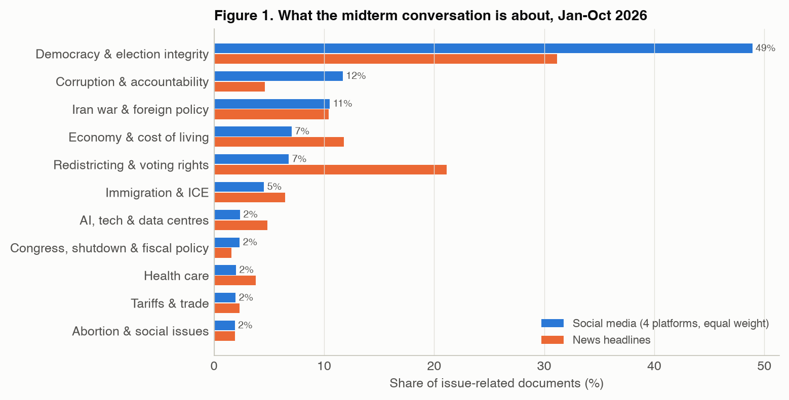
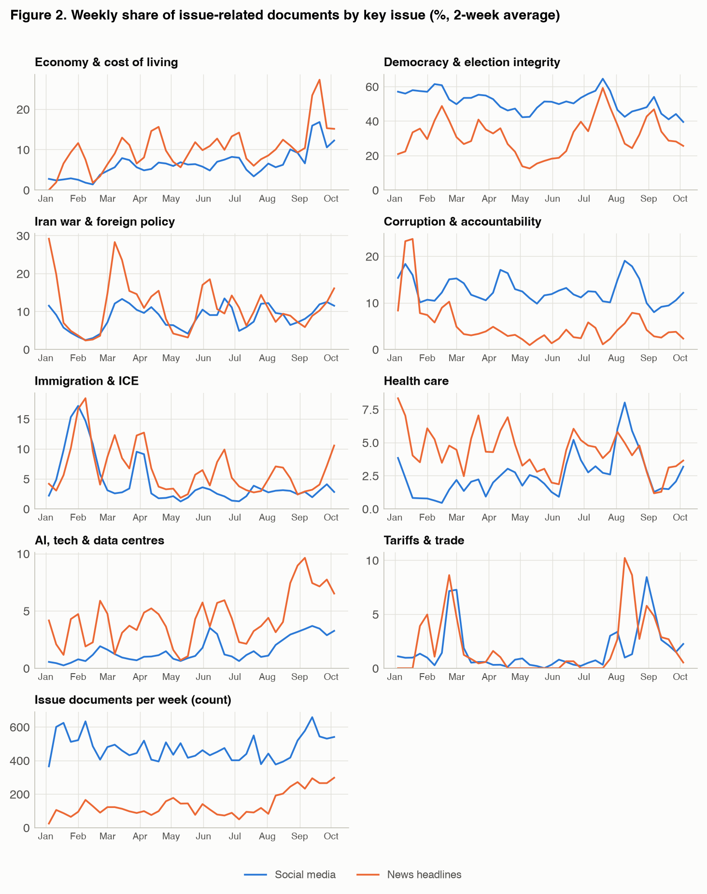
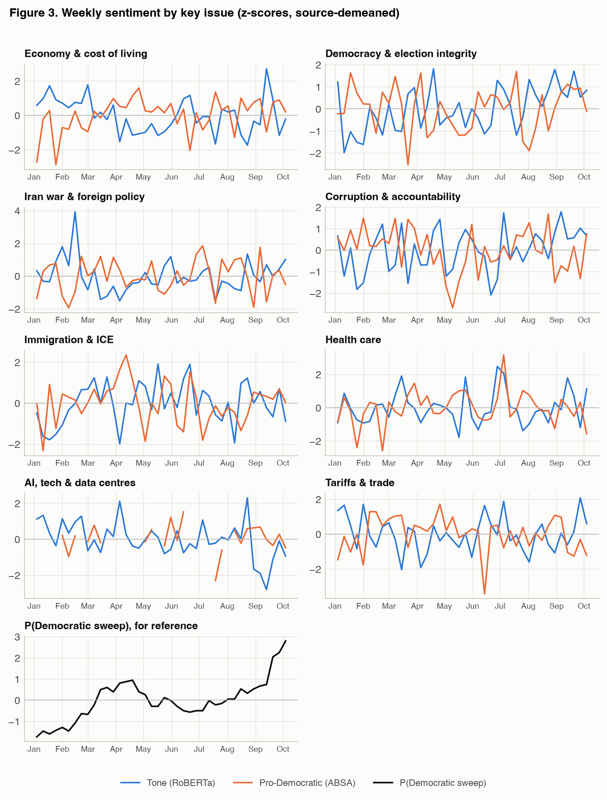
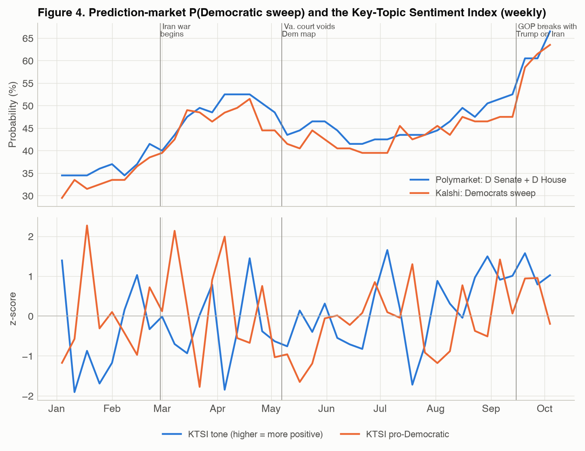
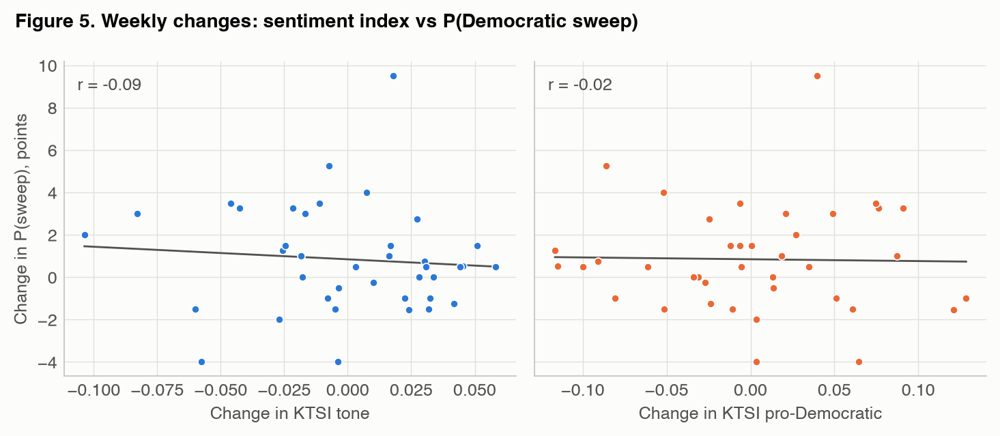
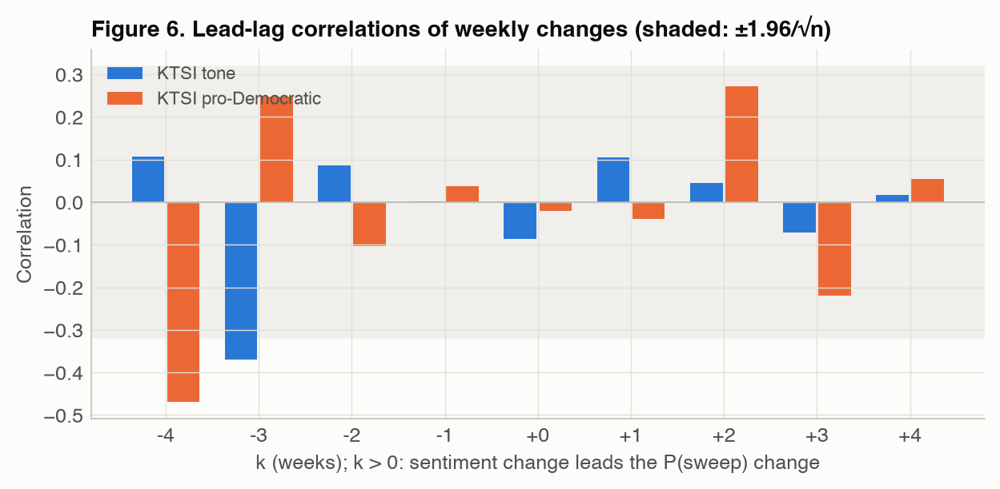
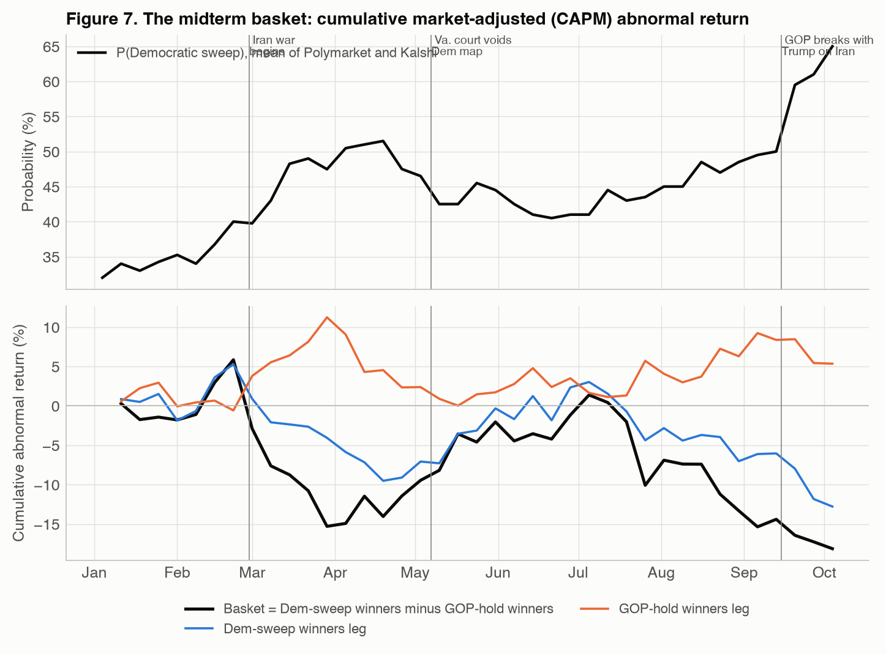
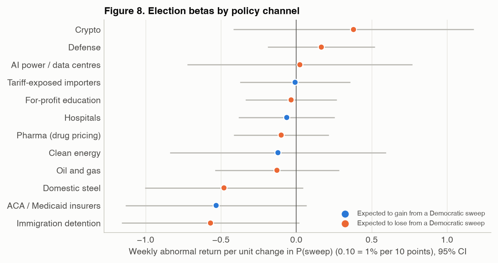

# Assignment 5 Report

### What Voters Care About in the 2026 Midterms, How the Mood Around It Tracks the Odds of a Democratic Sweep, and Which Stocks Move With It

FRE-GY 7871 A · NLP and the Investment Process · Fall 2026

<strong>Name:</strong> Yuri Moghaddam Nasrollahi 
<strong>NetID:</strong> ym3414 
<strong>GitHub repo:</strong> https://github.com/Yuri48/FinEng (folder <code>HW5</code>) 
<strong>Data as of:</strong> 5 October 2026 (text corpora); prediction markets and prices through 6 October. Election day is 3 November.

---

## 1. Summary

**What voters talk about.** When people write about the midterms, they mostly write about the election itself. In the
45,853 discovery documents, 42 percent are campaign and horse-race talk (polls, races, primaries, money, mobilisation) and
another 25 percent are about whether the election will be free and fair: fears that Trump will cancel, "nationalise" or rig
the midterms, mail-voting restrictions, the SAVE Act, federal agents at polling places. Among the documents that are about
an issue, election integrity takes 49 percent of the social-media conversation and 31 percent of the headlines. The policy
issues behind it are, in order of social-media attention, **corruption and accountability** (12 percent: Epstein files,
investigations, impeachment), **the Iran war and foreign policy** (11 percent), **the economy and cost of living** (7
percent, led by gas and diesel prices), **immigration and ICE** (5 percent), then AI and data centres, health care and
tariffs (2 percent each). The news ranks the economy and redistricting higher; the September polls rank the economy first.
I track eight key issues: election integrity, corruption, the Iran war, the economy, immigration, health care, AI and data
centres, and tariffs.

**Sentiment and the odds.** The sentiment module validates well: the tweet-trained RoBERTa matches 73.5 percent of 200
labelled documents on three-class tone (VADER: 49 percent, barely above the 47 percent majority baseline), and the
aspect-based partisan score has the right sign on 92 percent of the partisan documents. The environment it measures is
overwhelmingly negative and anti-incumbent: 77 percent of the 34,297 documents that name a party lean against Republicans.
That is consistent with what the event contracts priced, a rise in P(Democratic sweep) from 33 percent on 1 January to 65
percent on 5 October. But the *weekly variation* of the composite Key-Topic Sentiment Index carries almost no information
about the odds: its correlation with P(sweep) is 0.38 in levels (p = 0.07) and −0.09 in weekly changes, and neither
Granger-causes the other. One issue is the exception. **Economy sentiment moves with the odds**: in weeks when talk about the
economy turns more negative, the probability of a sweep rises (r = −0.29 in weekly changes, Newey-West t = −2.4), and the
partisan direction of economic talk tracks the odds in levels (r = 0.53, t = 5.3). Election integrity, half of the
conversation, shows nothing in changes.

**Stocks.** A long-short "midterm basket" of 47 stocks in twelve policy channels (ten of them fixed before looking at any
return) lost 17.8 percent market-adjusted in 2026 while the odds of a sweep doubled, the opposite of what the policy logic predicts. Week to
week it has no relation to the odds (election beta −0.09, t = −0.6) or to sentiment; its only significant driver is oil
(−1.5 percent per 10 percent rise in Brent, t = −2.6), because the Iran war lifted the oil names on its short side. Two channels did trade the election: **immigration detention** (GEO, CoreCivic) and **domestic steel** fell
in weeks when the sweep odds rose (t = −1.9 and −1.8). These are the two channels whose revenue depends most directly on what
Congress funds or extends.

**Conclusion.** Online sentiment about the midterms is a good thermometer of the *direction* of the environment and of *which
issue* matters, which is the economy, not the issue that dominates the conversation. It is not a leading indicator of the
odds once prediction markets exist, and the equity market has not priced a Democratic sweep into the broad policy-exposed
cross-section: with Trump keeping the veto, a sweep buys oversight and appropriations leverage, and only the stocks that live
on appropriations and tariffs respond.

## 2. Data

**Text.** Every document mentions the midterms. News headlines come from Google News RSS in two stages. Stage 1
(discovery) runs two queries a day that name no issue ("midterms" and "voters + congress/midterms/house race/senate
race"), so the topic model, not my query list, decides what the election is about. Stage 2 runs one query a day per key
issue found in stage 1 (each combines "midterms OR voters" with the issue's terms) to give the sentiment module enough
headlines per issue per week. Social media come from Bluesky (the top 100 English posts a day matching "midterms"),
Mastodon (the midterm hashtags on mastodon.social), Reddit (comments mentioning "midterm" in eight communities, two
left-leaning, three centrist and three right-leaning, through the Arctic Shift archive) and Lemmy. A social
post is kept only if its own text contains "midterm"; cross-posts and bot re-posts are dropped as exact duplicates.
Two collection problems had to be fixed and are worth recording. Google ignored the date operators for the first,
longer version of the stage-2 democracy query and returned the same day's results for every date; every headline is now
kept only if it was published within a day of the date it was requested for, and the democracy query was re-run in a
shorter form. And the Reddit archive's full-text search was rate limited to about one call a minute, so Reddit
contributes a random subset of the planned windows.

**Table 1. Corpus, 1 January - 5 October 2026**

<!-- BEGIN corpus -->
| Source | What | Documents | Days covered | Median length (chars) |
|---|---:|---:|---:|---:|
| News headlines (discovery) | Google News RSS, 2 issue-free election queries a day | 11,913 | 278 | 72 |
| Bluesky | Top 100 English posts a day matching 'midterms' | 24,174 | 278 | 137 |
| Mastodon | mastodon.social tag timelines: #midterms, #midterms2026, #midterm, #election2026, #2026midterms | 3,491 | 276 | 263 |
| Reddit | Comments mentioning 'midterm' in 8 political subreddits (sampled windows, Arctic Shift archive) | 2,094 | 195 | 238 |
| Lemmy | lemmy.world comments and posts mentioning 'midterm' | 4,181 | 278 | 350 |
| News headlines (issue queries) | Google News RSS, 7 issue-anchored election queries a day (stage 2) | 28,285 | 278 |  |
| Total |  | 74,138 |  |  |
<!-- END corpus -->

**Event contracts.** P(Democratic sweep) is the probability that Democrats control both chambers after the election.
Polymarket lists it as the "D Senate, D House" outcome of *Balance of Power: 2026 Midterms* (five mutually exclusive
outcomes, USD 18.8 million traded, open since July 2025); Kalshi lists it as "Democrats sweep" in its *Congress balance
of power combo* (open since 11 December 2025). I take the last print of each US/Eastern day (Kalshi: the bid-ask
midpoint) and average the two venues. Their weekly levels correlate at 0.97 and their weekly changes at 0.63. For the
stock regressions I use the hourly print at 16:00 ET on each trading day, so that a day's change in the probability lines
up with the day's close-to-close return.

**Equities.** Yahoo Finance adjusted closes for 47 stocks (Section 6), SPY as the market, Brent and the 10-year yield as
controls. 2025 is the estimation window for each stock's market model; 2026 is the event window.

## 3. What voters care about: topic modelling

**Method.** I fit BERTopic to 38,893 stage-1 documents (discovery headlines and social posts). Each document is
embedded with `all-mpnet-base-v2` (768 dimensions); UMAP reduces the embeddings to five dimensions (15 neighbours, cosine
metric) and HDBSCAN clusters them (minimum cluster size 90, minimum samples 10). HDBSCAN leaves a large share of short
posts unassigned (about a third in a trial run); I reassign a noise document to the nearest topic centroid only when the cosine similarity
is at least 0.40, which leaves 162 documents as noise. (A loader bug left the second Bluesky collection file, 6,960 posts from 16 July
to 5 October, out of the fit; rather than refit and relabel, I assigned those posts to the fitted topics with the same
nearest-centroid rule, cosine ≥ 0.40, which placed all but 0.6 percent. The discovery corpus is therefore 45,853
documents.) Each cluster is described by class-based TF-IDF on unigrams and
bigrams (with the election words themselves, "midterm(s)", "election(s)", "2026", removed, since every document contains
them) and by a maximal-marginal-relevance keyword list. The result is 89 topics.

HDBSCAN does not name its clusters, and 89 clusters are too many to correlate with anything, so the next step uses a large
language model as the labeller, the step BERTopic's LLM representations automate. Claude read each cluster's keywords and
six of its documents (three representative, three random) and gave it a short label and one of 13 categories: eight voter
issues, three other issue areas (redistricting and voting rights; abortion and social issues; Congress, shutdown and fiscal
policy), "campaign and horse race" (polls, races, primaries, candidates, money, mobilisation) and "other/noise". Appendix A
lists every cluster with its keywords, label and category, so each assignment can be checked. Impeachment threads went to
"corruption and accountability" rather than "campaign": they are about what a Democratic House would do to hold the
administration to account. Mixed or format-driven clusters (a news bot's summaries, hashtag spam, podcast round-ups,
non-English posts, and a cluster about the Indian National Congress's voter-roll dispute that the keyword "Congress"
pulled in) went to "other/noise".

**Salience.** The salience of an issue is its share of the documents that are about an issue (campaign/horse-race and noise
excluded), computed separately for each source. The voter measure averages the four social platforms with equal weight,
so that Bluesky's volume does not decide the ranking alone, and the news measure is the headline share. I then compare
the ranking with the issue questions of September polls.

**Table 2. Issue salience: share of issue-related documents by source (campaign/horse-race and noise topics excluded)**

<!-- BEGIN salience -->
| Issue | Social share (%) | News share (%) | Bluesky (%) | Mastodon (%) | Reddit (%) | Lemmy (%) | Rank (social) | Rank (news) | BGSU poll, Sep 2026 |
|---|---:|---:|---:|---:|---:|---:|---:|---:|---:|
| Democracy & election integrity | 48.9 | 31.2 | 52.7 | 38.8 | 55.3 | 48.8 | 1 | 1 | threats to democracy 24% |
| Corruption & accountability | 11.7 | 4.6 | 13.3 | 15.5 | 10.2 | 7.8 | 2 | 7 | government corruption 30% |
| Iran war & foreign policy | 10.5 | 10.4 | 6.8 | 10.1 | 12.1 | 13.1 | 3 | 4 | Middle East conflict 10%, foreign affairs 6% |
| Economy & cost of living | 7.1 | 11.8 | 6.1 | 9.8 | 4.7 | 7.6 | 4 | 3 | economy 38%, inflation 31% |
| Redistricting & voting rights | 6.8 | 21.1 | 7.4 | 8.4 | 5.7 | 5.7 | 5 | 2 | (not listed) |
| Immigration & ICE | 4.5 | 6.4 | 4.7 | 4.6 | 3.5 | 5.3 | 6 | 5 | immigration 25% |
| AI, tech & data centres | 2.4 | 4.8 | 1.1 | 4.8 | 0.6 | 2.9 | 7 | 6 | AI 8%, data centres 5% |
| Congress, shutdown & fiscal policy | 2.3 | 1.6 | 2.2 | 0.6 | 3.8 | 2.6 | 8 | 11 |  |
| Health care | 2.0 | 3.8 | 2.6 | 2.2 | 1.1 | 2.0 | 9 | 8 | health care 22% |
| Tariffs & trade | 2.0 | 2.3 | 1.5 | 1.9 | 2.3 | 2.1 | 10 | 9 | (not listed; taxes/fiscal 12%) |
| Abortion & social issues | 1.9 | 1.9 | 1.6 | 3.2 | 0.6 | 2.0 | 11 | 10 | abortion 6%, LGBTQ+ 3% |
<!-- END salience -->

Social share = equal-weighted mean of the four platforms' shares. BGSU poll: national likely voters, published 9 September 2026, up to three issues each.

**Results.** Figure 1 and Table 2 give the ranking. Three things stand out.

*First, the election is the issue.* Excluding campaign talk, election integrity takes 49 percent of social-media issue
documents and 31 percent of issue headlines, and it ranks first on every platform (39 percent on Mastodon to 55 percent on
Reddit). Its largest clusters are "Will Trump cancel the midterms?" (2,315 documents in the fit), "they're trying to steal
it" (2,200), Trump's plan to nationalise or subvert the election (1,185), election interference by federal agencies (680),
mail voting (817), the SAVE Act, voter ID and DOJ/DHS voter-roll purges. This is the "threats to democracy" item that 24
percent of likely voters picked in the September BGSU poll, but online it is louder than any poll suggests.

*Second, the policy issues rank differently in news and social media.* Social media give corruption and accountability (Epstein
files, investigations, impeachment) 12 percent against 5 percent in the news, and the news gives redistricting 21 percent
(court rulings on maps in Virginia, Missouri, Alabama, Louisiana, Florida) against 7 percent on social media. The economy
gets 12 percent of headlines and 7 percent of posts. Inside the economy, the largest cluster is gas and diesel prices, which
the Iran war and the closure of Hormuz pushed to record highs, then affordability, food prices and Trump's promise of a
$5,000 "dividend" if Republicans keep Congress.

*Third, compared with polls, the online conversation under-weights the economy.* The BGSU poll has the economy (38 percent)
and inflation (31 percent) first, then corruption (30), immigration (25), threats to democracy (24) and health care (22);
Rasmussen and Pew also have the economy first. Part of the gap is mechanical: a document is in the corpus only if it
mentions the midterms, which selects talk about the election itself, while economic grievance is usually expressed
without naming the election. Part is the platforms: the social sample leans left (Section 8), and left-of-centre users
write more about democracy and corruption. I therefore use the topic model to decide *which* issues to track and polls to
check the order. The eight key issues are the top six policy issues of Table 2 that also appear in the polls (election
integrity, corruption, Iran war, economy, immigration, health care), plus AI and data centres (larger than tariffs in
both the corpus and the BGSU poll, and the link to the AI-power stocks in Section 6) and tariffs (small in the conversation
but the most direct link between the election and stock prices). Redistricting is reported but not tracked: it is
a process story that the news covers and voters do not name.

The timing of attention (Figure 2) follows the news. Immigration peaks in January and February, after fatal shootings by
federal agents during the enforcement surge in Minneapolis and the protests that followed; the Iran war peaks in March and again from late summer;
tariffs spike after the Supreme Court struck most of them down on 20 February and again in August; and the economy's share
roughly doubles between August and the end of September, as fuel prices became the campaign's main economic story.

## 4. Measuring sentiment around the key issues

**Three measures per document.** (1) *Tone*: `cardiffnlp/twitter-roberta-base-sentiment-latest`, a RoBERTa model
fine-tuned on tweets, which suits the social register and handles headlines; the score is P(positive) − P(negative).
(2) *VADER*, the standard lexicon baseline. (3) *Partisan direction*. Tone alone does not say who is being criticised: "Trump's
tariffs are crushing farmers" and "Democrats are crushing it" have opposite tone and the same partisan meaning. For every
document that names a Republican-side entity (Trump, Republicans, GOP, MAGA, Vance, Speaker Johnson, Thune, cabinet members)
or a Democratic-side one (Democrats, DNC, Schumer, Jeffries, Harris, Newsom, ...), an aspect-based sentiment model
(`yangheng/deberta-v3-base-absa-v1.1`) scores the sentiment *toward* the first-named entity on each side. The document's
pro-Democratic score averages +tone toward Democrats and −tone toward Republicans over the sides it names; it is defined
for the documents that name a side (about half of them).

**Validation.** I drew a stratified random sample of 200 documents (50 discovery headlines, 25 issue headlines, 40 Bluesky,
30 Mastodon, 30 Lemmy and 25 Reddit posts) and had each labelled for tone (−1/0/+1) and partisan direction (+1 favours
Democrats or criticises Trump/GOP, −1 the reverse, 0 neutral or unclear). The labels were produced by an LLM reading each
text (see AI_USE.md), so Table 3 measures agreement with an LLM annotator rather than with a human panel.

**From documents to a weekly index.** For each key issue *k* and week *w*, I subtract from every document's score the mean
score of its source on that issue (so that a platform's baseline, Bluesky being far more negative than headlines, cannot
show up as a change), average within each source-issue-week cell with at least five documents, and then average the
sources with equal weight. The *Key-Topic Sentiment Index* (KTSI) is the average of the issue series weighted by each issue's
social-media salience (Table 2), renormalised over the issues observed that week. It comes in two versions, tone and
pro-Democratic, plus an equal-weighted variant and a VADER variant for robustness.

**Table 3. Validation against 200 labelled documents**

<!-- BEGIN validation -->
| Tone measure | n | Spearman ρ | 3-class accuracy | Macro-F1 | Majority-class baseline |
|---|---:|---:|---:|---:|---:|
| RoBERTa tone | 200 | 0.70 | 0.73 | 0.74 | 0.47 |
| VADER tone | 200 | 0.41 | 0.49 | 0.46 | 0.47 |

| Partisan measure | n scored | Coverage | Spearman ρ | n labelled ±1 | Sign accuracy |
|---|---:|---:|---:|---:|---:|
| ABSA pro-Democratic | 109 | 0.55 | 0.54 | 86.00 | 0.92 |
| Naive tone x party | 97 | 0.48 | 0.45 | 77.00 | 0.87 |
| RoBERTa tone (as proxy) | 200 | 1.00 | -0.44 | 117.00 | 0.80 |
<!-- END validation -->

RoBERTa tone agrees with the labels far better than VADER (Spearman 0.71 against 0.41; 73.5 percent three-class
accuracy against 49 percent), and its errors are almost all between adjacent classes (no negative document is scored
positive, and no positive one negative). For partisan direction, the aspect-based score gets the sign right on 92 percent of
the 86 labelled partisan documents it covers, against 87 percent for the naive "flip the tone by the party mentioned" rule.
Even document tone alone gets the partisan sign right 80 percent of the time, because in this corpus negativity is mostly
aimed at the incumbent party. Of the 200 sampled documents, 109 are labelled pro-Democratic or critical of Trump/GOP and
8 the reverse; two (1 percent) are about school midterm exams, a measure of how little noise the "midterm" filter lets
in.

The KTSI weights follow social-media salience: election integrity 0.55, corruption 0.13, Iran war 0.12, economy 0.08,
immigration 0.05, AI and data centres 0.03, health care 0.02, tariffs 0.02. Figure 3 shows the eight weekly issue series.
They are noisy, as weekly averages of a few dozen to a few hundred documents are. The two measures of the same issue
are related but distinct: tone says how angry the conversation is, partisan direction says at whom.

## 5. Sentiment and the probability of a Democratic sweep

**Table 4. Correlation of each sentiment index with P(Democratic sweep), weekly, 4 January - 4 October 2026**

<!-- BEGIN corr_pm -->
| Index | r (levels) | ρ (levels) | NW t (levels) | r (weekly changes) | NW t (changes) | Weeks |
|---|---:|---:|---:|---:|---:|---:|
| KTSI tone (RoBERTa, salience-weighted) | 0.38 | 0.34 | 1.83* | -0.09 | -0.66 | 40 |
| KTSI pro-Democratic (ABSA, salience-weighted) | 0.12 | 0.11 | 0.95 | -0.02 | -0.17 | 40 |
| KTSI tone (VADER) | -0.11 | -0.04 | -1.12 | -0.01 | -0.05 | 40 |
| KTSI tone, equal weights | -0.04 | -0.04 | -0.23 | -0.09 | -0.93 | 40 |
| KTSI pro-Democratic, equal weights | 0.24 | 0.28 | 2.04** | -0.05 | -0.51 | 40 |
| Tone: Economy | -0.38 | -0.51 | -1.93* | -0.29 | -2.43** | 40 |
| Tone: Democracy | 0.47 | 0.46 | 2.81*** | -0.02 | -0.13 | 40 |
| Tone: Iran war | -0.18 | -0.21 | -1.11 | -0.06 | -0.48 | 40 |
| Tone: Corruption | 0.35 | 0.37 | 2.13** | -0.01 | -0.09 | 40 |
| Tone: Immigration | 0.14 | 0.15 | 0.67 | -0.11 | -0.88 | 40 |
| Tone: Health care | 0.17 | 0.21 | 1.31 | 0.17 | 1.20 | 40 |
| Tone: AI/data centres | -0.37 | -0.40 | -2.13** | 0.04 | 0.20 | 40 |
| Tone: Tariffs | -0.13 | -0.22 | -0.62 | -0.05 | -0.35 | 40 |
| Pro-Dem: Economy | 0.53 | 0.59 | 5.28*** | 0.20 | 1.52 | 40 |
| Pro-Dem: Democracy | -0.03 | -0.03 | -0.19 | -0.09 | -0.83 | 40 |
| Pro-Dem: Iran war | 0.06 | 0.03 | 0.58 | 0.12 | 0.98 | 40 |
| Pro-Dem: Corruption | -0.15 | -0.18 | -1.11 | 0.03 | 0.23 | 40 |
| Pro-Dem: Immigration | 0.27 | 0.30 | 2.67*** | -0.04 | -0.33 | 40 |
| Pro-Dem: Health care | 0.00 | 0.06 | 0.02 | -0.32 | -3.62*** | 40 |
| Pro-Dem: AI/data centres | -0.20 | -0.27 | -1.54 | -0.09 | -0.64 | 27 |
| Pro-Dem: Tariffs | -0.02 | 0.00 | -0.08 | -0.09 | -0.86 | 40 |
<!-- END corr_pm -->

Levels: Pearson r, Spearman ρ, and the Newey-West (4 lags) t-statistic of the slope of z(P) on z(index). Changes: Pearson r of weekly changes and the Newey-West (2 lags) t-statistic. * p < 0.10, ** p < 0.05, *** p < 0.01. Issue rows use the issue's own weekly series.

**Levels.** The composite tone index co-moves with the sweep probability (r = 0.38, Newey-West t = 1.8, p = 0.07): the
conversation got somewhat less negative as Democrats' chances improved, most visibly from August. The pro-Democratic index
does not (r = 0.12), and the VADER version shows nothing. Several issue series correlate with the odds in levels with the
signs one would expect: the partisan direction of economic talk (r = 0.53, t = 5.3) and of immigration talk (0.27, t = 2.7)
rise with the odds, and economic tone falls (−0.38, t = −1.9). But level correlations between two trending series are weak
evidence, and the sample is 40 weeks.

**Changes.** In weekly changes, the composite indices are uncorrelated with the odds (tone −0.09, pro-Democratic −0.02,
equal-weighted versions −0.05 to −0.09; all t-statistics below 1), and no composite index Granger-causes the odds or is
Granger-caused by them (Table 5). The lead-lag correlations show no systematic pattern: the few that cross the ±0.32 band
(for example −0.47 at a four-week lag for the pro-Democratic index) are isolated and alternate in sign, which is what 171
correlations on 39 observations produce by chance.

**The economy is the exception.** Economic tone is the one issue series whose weekly changes move with the odds with the
expected sign: weeks in which economic talk turns more negative are weeks in which the probability of a sweep rises (r =
−0.29, Newey-West t = −2.4, p = 0.015; Spearman −0.25; dropping any single week leaves r between −0.33 and −0.18). The
largest contribution is the week to 20 September, when the sweep probability jumped 9.5 points and economic tone fell.
Economic partisan direction points the same way (r = 0.20, t = 1.5). Election integrity, half of the conversation and 55
percent of the index weight, shows nothing in changes (r = −0.02), which is why the salience-weighted index fails: it
weights the issue that voters talk about most and that moves the odds least.

One other issue series is significant, with the opposite sign: the partisan direction of health-care talk falls in weeks when
the sweep probability rises (r = −0.32, t = −3.6), robust to dropping any week. A plausible reading is reverse causation:
the administration answered bad weeks with health-care announcements (the $90 checks to seniors in the week to 4 October,
one of the three weeks that drive the correlation, is an example), which would make health coverage friendlier to Trump
exactly when the odds moved against him. With 32 issue-level change tests, one or two significant results are expected by chance, and this one is
not part of the conclusions.

**Where the odds actually moved.** The sweep probability rose in steps tied to events (Figure 4): from 33 to about 40
percent by late February (the Supreme Court tariff ruling, Trump's approval at new lows), to 52 percent in April after the
Iran war began, back to 41 to 43 percent in May and June after Virginia's Supreme Court voided the Democratic map and
Republican-drawn maps survived in other states, and from 45 to 65 percent between August and October as diesel prices hit
records, Republican nominees broke with Trump on the war, and the generic ballot opened to D+12. The Senate is the
marginal chamber: on 5 October Kalshi priced a Democratic House at 91 percent and a Democratic Senate at 65 percent, so the
sweep contract is in effect a Senate contract. The text measures reacted to the same events, but the prediction markets
moved first and further.

**Table 5. Lead-lag correlations of weekly changes, corr(Δindex at t−k, ΔP at t), and Granger tests (2 lags)**

<!-- BEGIN leadlag -->
| Index | k=-4 | k=-3 | k=-2 | k=-1 | k=+0 | k=+1 | k=+2 | k=+3 | k=+4 | Granger: index → P (p) | Granger: P → index (p) |
|---|---:|---:|---:|---:|---:|---:|---:|---:|---:|---:|---:|
| KTSI tone (RoBERTa, salience-weighted) | 0.11 | -0.37 | 0.09 | 0.00 | -0.09 | 0.10 | 0.04 | -0.07 | 0.02 | 0.88 | 0.95 |
| KTSI pro-Democratic (ABSA, salience-weighted) | -0.47 | 0.25 | -0.10 | 0.04 | -0.02 | -0.04 | 0.27 | -0.22 | 0.06 | 0.26 | 0.87 |
| KTSI tone (VADER) | 0.14 | -0.14 | -0.05 | -0.03 | -0.01 | 0.04 | -0.02 | -0.14 | 0.10 | 0.98 | 0.93 |
| Tone: Economy | 0.20 | -0.20 | 0.14 | -0.14 | -0.29 | 0.22 | -0.17 | 0.48 | -0.29 | 0.22 | 0.21 |
| Tone: Democracy | 0.23 | -0.41 | 0.14 | 0.01 | -0.02 | -0.04 | 0.21 | -0.04 | -0.10 | 0.45 | 0.63 |
| Tone: Iran war | -0.11 | -0.06 | 0.12 | -0.12 | -0.06 | 0.19 | -0.27 | -0.13 | 0.23 | 0.23 | 0.81 |
| Tone: Corruption | -0.25 | 0.07 | -0.14 | 0.05 | -0.01 | 0.20 | -0.10 | -0.13 | 0.12 | 0.59 | 0.48 |
| Tone: Immigration | 0.04 | -0.04 | -0.14 | 0.12 | -0.11 | -0.04 | -0.04 | -0.04 | 0.14 | 0.85 | 0.77 |
| Tone: Health care | -0.03 | 0.05 | -0.03 | -0.21 | 0.17 | 0.12 | -0.10 | 0.07 | 0.01 | 0.49 | 0.70 |
| Tone: AI/data centres | -0.11 | 0.18 | -0.15 | 0.13 | 0.04 | -0.02 | 0.07 | -0.28 | 0.20 | 0.92 | 0.48 |
| Tone: Tariffs | -0.07 | -0.07 | -0.14 | 0.26 | -0.05 | -0.17 | 0.14 | 0.03 | -0.14 | 0.40 | 0.56 |
| Pro-Dem: Economy | -0.42 | 0.16 | -0.04 | 0.11 | 0.20 | -0.24 | 0.26 | -0.25 | 0.02 | 0.24 | 0.21 |
| Pro-Dem: Democracy | -0.31 | 0.14 | 0.04 | -0.08 | -0.09 | 0.04 | 0.10 | -0.04 | -0.00 | 0.74 | 0.74 |
| Pro-Dem: Iran war | -0.27 | 0.18 | -0.09 | -0.05 | 0.12 | -0.17 | 0.20 | -0.00 | -0.07 | 0.45 | 0.88 |
| Pro-Dem: Corruption | -0.18 | -0.01 | -0.06 | 0.20 | 0.03 | 0.02 | 0.14 | -0.34 | 0.27 | 0.66 | 0.33 |
| Pro-Dem: Immigration | 0.23 | 0.12 | -0.31 | 0.17 | -0.04 | 0.12 | 0.16 | -0.02 | -0.04 | 0.49 | 0.13 |
| Pro-Dem: Health care | 0.04 | -0.06 | -0.20 | 0.17 | -0.32 | 0.16 | 0.28 | -0.11 | -0.14 | 0.02 | 0.17 |
| Pro-Dem: AI/data centres | -0.11 | 0.01 | -0.28 | -0.06 | -0.27 | -0.08 | -0.19 | -0.13 | 0.12 | 0.75 | 0.36 |
| Pro-Dem: Tariffs | 0.03 | -0.12 | 0.02 | 0.04 | -0.09 | 0.04 | -0.10 | 0.06 | -0.09 | 0.88 | 0.99 |
<!-- END leadlag -->

## 6. The midterm basket

**Choosing the stocks.** With Trump keeping the veto, a Democratic Congress cannot pass its own agenda. What a sweep
changes is (i) whether Republicans can pass a second reconciliation bill, (ii) leverage over appropriations and shutdown
deadlines, (iii) oversight and subpoenas, and (iv) whether the tariff and enforcement programmes are funded and extended.
I selected channels where (i)-(iv) bite on an identifiable revenue line. Ten were fixed, with their stocks and expected
signs, before looking at any 2026 return; two (AI power producers and big pharma) were added after a first estimate of the
ten-channel basket, on the strength of the news screen described below. The ten-channel basket gives the same null result
as the final one (weekly election beta −0.07, t = −0.4; daily 0.08, t = 0.8), so the addition does not drive any conclusion. *Expected to gain from a sweep*: hospitals and ACA/Medicaid insurers (funding deadlines
used to restore the enhanced ACA subsidies that lapsed at the end of 2025 and to delay the Medicaid cuts in the 2025
reconciliation law), clean energy (no further rollback of the remaining credits), and tariff-exposed importers (no tariff
extensions; forced votes). *Expected to lose*: immigration detention (ICE contracts depend on appropriations and survive
oversight only under GOP control), defense (the GOP topline), oil and gas, crypto (market-structure legislation and a
friendly Financial Services Committee), domestic steel (the other side of the tariff), for-profit education, AI power
producers (federal pre-emption of state AI rules and fast-track permitting are GOP priorities; Democrats campaign on
data-centre electricity costs, one of the key issues found in Section 3), and big pharma (a Democratic Congress can send
Trump a codified most-favoured-nation bill he would likely sign). A screen of 308 headlines that pair the midterms with
markets (weekly Google News queries, `collect_news.py equities`; counts in `output/table_news_sector_mentions.csv`) supports four of the channels and is silent
on the rest: it ties a Democratic sweep most often to crypto (50 headlines mention crypto or bitcoin, typically around the
stalled CLARITY Act) and to AI/data-centre stocks (18; JPMorgan's and Bank of America's warnings that a blue wave could hit
them), calls defense stocks "out of favor" on blue-wave risk, and expects solar and power equipment to gain. It says nothing
about hospitals, detention or pharma, which rest on the policy argument alone. Ameriprise's September 2026 note likewise
lists clean energy as a sweep winner and traditional energy, pharmaceuticals and large technology as losers.

**Market adjustment and the basket.** For each stock I estimate a market model on 2025 daily returns against SPY and
compute 2026 abnormal returns AR = r − α − β·r(SPY). The basket is long the Democratic-sweep-winner channels and short the
Republican-hold-winner channels, equal-weighted within each channel and across channels within each leg, so no single
crowded channel dominates. Its cumulative abnormal return (CAR) is the market-adjusted performance the assignment asks for.
An *election beta* is the slope of a stock's (or channel's) abnormal return on the change in P(sweep).

**Table 6. Policy channels, 2026 cumulative abnormal returns and election betas**

<!-- BEGIN channels -->
| Channel | Stocks | Expected sign | CAR 2026 (%) | β daily (t) | β weekly (t) | Sign as expected |
|---|---:|---:|---:|---:|---:|---:|
| ACA / Medicaid insurers | CNC, MOH, OSCR, ELV | + | 52.2 | -0.09 (-0.56) | -0.53 (-1.74) | no |
| AI power / data centres | VST, CEG, TLN | − | -37.0 | 0.11 (0.55) | 0.02 (0.06) | no |
| Clean energy | FSLR, ENPH, RUN, NEE, SEDG | + | -55.1 | 0.10 (0.36) | -0.12 (-0.33) | no |
| Crypto | COIN, HOOD, MSTR, CRCL | − | 5.9 | 0.05 (0.24) | 0.38 (0.93) | no |
| Defense | LMT, NOC, GD, HII, LHX | − | -32.2 | 0.02 (0.23) | 0.17 (0.92) | no |
| Domestic steel | NUE, STLD, CLF | − | -9.5 | -0.27 (-1.53) | -0.48 (-1.79) | yes |
| For-profit education | LOPE, STRA, PRDO | − | 0.3 | -0.11 (-0.70) | -0.03 (-0.22) | yes |
| Hospitals | HCA, THC, UHS, CYH | + | -28.6 | 0.03 (0.24) | -0.06 (-0.39) | no |
| Immigration detention | GEO, CXW | − | 88.2 | -0.29 (-1.20) | -0.57 (-1.89) | yes |
| Oil and gas | XOM, CVX, COP, OXY, DVN | − | 33.4 | -0.00 (-0.01) | -0.13 (-0.61) | yes |
| Pharma (drug pricing) | PFE, MRK, BMY, ABBV | − | 15.0 | -0.05 (-0.60) | -0.10 (-0.62) | yes |
| Tariff-exposed importers | NKE, DECK, HAS, BBY, DLTR | + | -7.6 | -0.11 (-0.72) | -0.01 (-0.04) | no |
| BASKET |  | + | -17.8 | 0.05 (0.51) | -0.09 (-0.55) |  |
| LONG leg |  | + | -9.8 | -0.02 (-0.21) | -0.18 (-1.92) |  |
| SHORT leg |  | − | 8.0 | -0.07 (-0.94) | -0.09 (-1.01) |  |
<!-- END channels -->

CAR: cumulative market-model abnormal return, 2 January - 6 October 2026, equal-weighted within the channel. β: abnormal return per unit change in P(sweep) (0.10 = 1% per 10 points), daily (16:00 ET prints, 189 days) and weekly (39 weeks); Newey-West t-statistics in parentheses. Expected sign: + if a Democratic sweep should help the channel.

**Table 7. The basket against sentiment and the sweep probability**

<!-- BEGIN basket_corr -->
| Series correlated with the basket | r (levels: CAR) | NW t (levels) | r (weekly changes: AR) | NW t (changes) |
|---|---:|---:|---:|---:|
| KTSI tone | -0.33 | -1.59 | 0.03 | 0.22 |
| KTSI pro-Democratic | -0.11 | -0.86 | -0.07 | -0.48 |
| P(Democratic sweep) | -0.83 | -9.28*** | -0.05 | -0.43 |
<!-- END basket_corr -->

<!-- BEGIN basket_reg -->
| Regressor | (1) dP | (2) d tone index | (3) d pro-Dem index | (4) dP + controls | (5) d pro-Dem + controls | (6) all |
|---|---:|---:|---:|---:|---:|---:|
| ΔP(sweep) | -5.92 (-0.40) |  |  | -3.52 (-0.18) |  | -5.25 (-0.29) |
| ΔKTSI tone |  | 0.52 (0.05) |  |  |  | -16.11 (-1.29) |
| ΔKTSI pro-Dem |  |  | -3.19 (-0.46) |  | 0.99 (0.11) | -0.71 (-0.09) |
| Brent return |  |  |  | -14.92 (-2.58)*** | -15.23 (-2.17)** | -18.71 (-2.37)** |
| Δ10y yield |  |  |  | 5.75 (0.82) | 5.93 (0.76) | 7.84 (0.89) |
| R² | 0.003 | 0.000 | 0.004 | 0.125 | 0.124 | 0.155 |
| Weeks | 39 | 39 | 39 | 39 | 39 | 39 |
<!-- END basket_reg -->

Top: correlation of the basket's cumulative abnormal return (levels) and weekly abnormal return (changes) with each series; Newey-West t-statistics. Bottom: weekly basket abnormal return (%) regressed on the weekly changes shown; Newey-West (2) t-statistics in parentheses.

**Performance.** The basket's cumulative market-adjusted return in 2026 is −17.8 percent: the Democratic-sweep-winner leg
lost 9.8 percent and the Republican-hold-winner leg gained 8.0 percent (Figure 7). Read naively, the basket fell while the
odds of a sweep doubled, and its level is strongly *negatively* correlated with P(sweep) (r = −0.84, Table 7). That
correlation is a common trend, not a price of the election: in weekly abnormal returns the correlation is −0.05, the
election beta is −0.09 (t = −0.6) weekly and 0.05 (t = 0.5) daily, and the betas estimated in January to May have a rank
correlation of only 0.16 (p = 0.29) with those estimated in June to October. Of the 47 stocks, 21 have a weekly beta with the
expected sign, fewer than a coin flip would give. On the twelve days with the largest moves in the sweep probability, the
basket moved the way the policy logic predicts eight times, by 0.54 percent on average (t = 1.4): suggestive, not
significant.

**What drove it instead.** Oil. Adding the weekly Brent return and the change in the 10-year yield to the regression
raises the R² from 0.002 to 0.125, and the Brent coefficient is −14.9 (t = −2.6): a 10 percent rise in Brent costs the
basket about 1.5 percent. On the short side, oil and gas (+33 percent abnormal), which the Iran war lifted, and immigration
detention (+88 percent) gained; on the long side, clean energy (−55 percent) and hospitals (−29 percent) fell for reasons
unrelated to the election odds. The same war pushed the sweep probability up, so the basket and the odds trended in opposite
directions without one pricing the other.

**Sentiment and the basket.** Neither sentiment index explains the basket: the correlation of weekly changes in the index
with weekly abnormal returns is 0.03 (tone) and −0.07 (pro-Democratic), and their coefficients stay insignificant with the
Brent and 10-year controls (Table 7). In levels the correlation with the tone index is −0.33 (t = −1.6).

**The channels that did respond.** Two channels have election betas with the expected sign and t-statistics near −1.9: immigration
detention (−0.57: GEO and CoreCivic lose about 5.7 percent, market-adjusted, for a 10-point rise in the sweep probability)
and domestic steel (−0.48). They are the two channels whose revenue depends most directly on Congress: ICE detention
contracts on appropriations and oversight, steel on tariffs that a Democratic Congress would not extend. The ACA/Medicaid
insurers have a beta of similar size with the *wrong* sign (−0.53, t = −1.7), and crypto, the sector the news most often
tied to a sweep, has a positive (wrong-signed) beta, as does defense.

## 7. Conclusions

1. **The midterm conversation is about the election itself, and the economy is the issue that matters.** Two-thirds of what
   is written about the midterms is horse race or fear for the integrity of the vote. Among policy issues, corruption, the
   Iran war, the economy and immigration lead, with health care, AI and tariffs behind. The topic model and the polls agree on
   the set of issues but not on the order: the polls put the economy first, online talk puts it fourth. The one issue whose
   sentiment moves with the market-implied odds in the expected direction is the economy (weekly change correlation −0.29), consistent with the polls
   and with the view of midterms as a referendum on the president's economy.

2. **Sentiment measures the direction of the environment, not its changes.** The corpus is overwhelmingly anti-incumbent
   (77 percent of partisan documents lean against Republicans), which agrees with a sweep probability that doubled to 65
   percent. But the composite index does not lead the odds, does not Granger-cause them, and its weekly changes are
   uncorrelated with theirs. The prediction markets move on events (the Iran war, court rulings on maps, Republican
   defections on the war) faster and more cleanly than any average of text. For forecasting the election, the markets
   are the better instrument; the text is useful for explaining which issue is moving them.

3. **Weighting by attention is the wrong weighting.** The salience-weighted index puts 55 percent of its weight on election
   integrity, the most-discussed issue and the least informative about the odds. An index built to predict the market
   would weight the economy, which is 8 percent of the weight and the only issue with a significant change correlation. The
   loudest issue is not the one that moves votes.

4. **The equity market has not priced a Democratic sweep into the policy-exposed cross-section.** A basket built from twelve
   policy channels did not trade the election: no relationship with weekly changes in the odds or in sentiment, unstable
   betas, and a −17.8 percent market-adjusted return explained by the oil shock of the Iran war. This is what one should expect
   when the president keeps the veto: a Democratic Congress can investigate, refuse to extend and refuse to fund, but cannot
   legislate, so most sector theses priced as "blue wave trades" have little cash-flow content.

5. **Where Congress holds the purse, stocks respond.** Immigration detention and domestic steel, whose revenues depend on
   appropriations and on tariffs that a Democratic Congress would not extend, fell in weeks when the sweep odds rose. That is
   the one place where the policy argument, the event contracts and the stock prices line up. With t-statistics near 1.9 on
   39 weeks, it is a finding to test on the election-night reaction on 3-4 November, not a result to rely on.

## 8. Limitations

- **The social sample leans left.** Bluesky, Mastodon and Lemmy are left-of-centre platforms; right-leaning voices enter
  mainly through the Reddit communities, which contribute 2,094 documents. Salience is reported by source, and the index
  removes each source's baseline, but its level is not a measure of national opinion, and the issue ranking of right-leaning
  voters (who would weight immigration and the economy more) is under-represented.
- **Keyword selection.** Every document mentions the midterms, which over-selects talk about the election itself. The
  stage-2 issue queries add headlines per issue but do not fix this for social media.
- **LLM steps.** Topic labels and validation labels were produced by an LLM (AI_USE.md). The topic labels are listed in
  Appendix A for checking; the validation is agreement with an LLM annotator, not with human coders.
- **Coverage gaps.** Reddit contributes a random 15 percent of the planned windows (rate limits); 6,960 Bluesky posts were
  assigned to topics after the fit rather than in it; Bluesky contributes the top 100 posts a day, which over-weights
  widely shared posts.
- **Short sample, many tests.** Forty weekly observations and 32 issue-level change tests: individual issue results at the
  5 percent level should be read with that in mind. The economy result survives dropping any single week but would not
  survive a Bonferroni correction.
- **No causal identification.** The correlations do not separate sentiment moving odds from both responding to events, and
  the Iran war moved sentiment, odds and the basket at the same time.
- **Market model.** Betas are estimated on 2025, before the war; abnormal returns inherit any change in betas, and channel
  results rest on two to five stocks each.

---

## Appendix A. Topic model: every cluster, its LLM label and its issue

<!-- BEGIN topics -->
| Topic | Docs | Social share | Issue | Label (LLM) | Keywords (c-TF-IDF) |
|---|---:|---:|---:|---:|---:|
| 26 | 363 | 0.59 | AI, tech & data centres | AI industry, regulation and AI super PACs | ai, openai, industry, tech, meta, regulation, artificial |
| 46 | 220 | 0.47 | AI, tech & data centres | Data centres and electricity bills | data centers, centers, data, data center, center, ai data, electricity |
| 73 | 157 | 0.85 | Abortion & social issues | Trans rights | trans, transgender, lgbtq, queer, transrights, sports, beshear |
| 72 | 150 | 0.71 | Abortion & social issues | Religion, the Pope and Christian nationalism | pope, christian, leo, catholic, religious, religion, god |
| 76 | 134 | 0.72 | Abortion & social issues | Abortion and the abortion pill | abortion, fda, antiabortion, reproductive, access, circuit, sun |
| 0 | 4447 | 0.98 | Campaign & horse race | 'Vote blue' mobilisation and get-out-the-vote chatter | vote blue, thank, wait, coming, lets, vote, vote vote |
| 7 | 1302 | 0.47 | Campaign & horse race | What to watch, voter guides, takeaways | watch, questions, races watch, guide, politics, issues, shaping |
| 65 | 963 | 0.89 | Campaign & horse race | Democratic strategy and the DNC | dems, strategy, winning strategy, affect, winning, democrats, bad news |
| 9 | 832 | 0.20 | Campaign & horse race | Primary results and voter guides | live results, primary, voter guide, congressional district, guide, primaries, results |
| 13 | 728 | 0.89 | Campaign & horse race | Campaign ads and messaging, taxpayer-funded pro-Trump ads | ad, ads, message, messaging, campaign ad, winning message, slogan |
| 83 | 710 | 0.56 | Campaign & horse race | Trump's popularity slips, Republicans brace | distance, trump voters, slips, gop, republicans brace, trump gop, distance trump |
| 51 | 578 | 0.90 | Campaign & horse race | 2028 and long-range predictions | presidential, predictions, focus, lets, nominee, aoc, sweep |
| 24 | 569 | 0.44 | Campaign & horse race | Polls, generic ballot, independents | poll, democrats hold, independents, democrats lead, enthusiasm, generic, harry enten |
| 33 | 533 | 0.44 | Campaign & horse race | Registration, early voting, voting from abroad | early voting, votefromabroad, request ballot, register, early, request, registration |
| 12 | 518 | 0.56 | Campaign & horse race | Texas politics and races | texas, politics uspol, uspol news, county, abbott, tarrant county, tarrant |
| 87 | 514 | 0.50 | Campaign & horse race | Warning signs and predictions for the GOP | warning signs, warning, signs, warns gop, predicts gop, gingrich, glaring |
| 23 | 504 | 0.37 | Campaign & horse race | Senate races, odds and control of Congress | senate races, races, odds, senate, seats, flip, senate seats |
| 34 | 491 | 0.98 | Campaign & horse race | Countdown posts ('N days until the midterms') | days, inauguration, progress, days vote, trump days, presidential, countdown |
| 43 | 442 | 0.54 | Campaign & horse race | Money in politics, super PACs, corporate spending | donations, spending, cash, pacs, money, million, billionaires |
| 35 | 407 | 0.56 | Campaign & horse race | Trump approval ratings | approval, trumps approval, rating, approval rating, trump approval, low, poll |
| 39 | 400 | 0.73 | Campaign & horse race | Socialists, DSA and 'communism' attacks | dsa, communists, communism, socialists, socialist, communist, democratic socialists |
| 38 | 386 | 0.33 | Campaign & horse race | Trump rallies ('cheat like hell') | rallies, trump rallies, cheat hell, oklahoma, pretend, pretend ballot, ahead trump |
| 22 | 380 | 0.40 | Campaign & horse race | California races and Newsom | california, newsom, californias, gavin newsom, gavin, arizona, mayoral |
| 31 | 353 | 0.87 | Campaign & horse race | Elon Musk's spending for the GOP | musk, elon, elon musk, musks, elon musks, pac, tesla |
| 66 | 345 | 0.94 | Campaign & horse race | MAGA banter | maga, magas, maga republicans, schmuck jeffries, vote maga, schmuck, maga comedy |
| 25 | 337 | 0.30 | Campaign & horse race | Crypto money, stocks and prediction markets | crypto, stocks, stock, markets, prediction markets, market, stock market |
| 48 | 294 | 0.80 | Campaign & horse race | Jeffries, Schumer and the Kushner meeting | jeffries, schumer, hakeem jeffries, hakeem, kushner, chuck, chuck schumer |
| 28 | 280 | 0.70 | Campaign & horse race | JD Vance | vance, jd, jd vance, trump vance, vances, vice president, vice |
| 63 | 275 | 0.74 | Campaign & horse race | Trump's war chest and campaign money | war chest, chest, slush, slush fund, fund, spend, insurrectionists |
| 54 | 256 | 0.61 | Campaign & horse race | Maine Senate race | maine, platner, collins, susan, graham platner, susan collins, maine senate |
| 62 | 247 | 0.78 | Campaign & horse race | Speaker Mike Johnson | johnson, mike johnson, mike, speaker, speaker johnson, speaker mike, johnsons |
| 68 | 244 | 0.57 | Campaign & horse race | Congressional retirements | reelection, retiring, retirement, house republican, seek, recess, retire |
| 88 | 240 | 0.79 | Campaign & horse race | Blue wave | blue wave, wave, blue, tsunami, blue tsunami, wave coming, tidal |
| 49 | 231 | 0.34 | Campaign & horse race | Michigan Senate race | michigan, elsayed, michigan senate, abdul elsayed, abdul, rogers, michigans |
| 64 | 210 | 0.40 | Campaign & horse race | Georgia races | georgia, georgias, atlanta, wabe, ossoff, journalconstitution, atlanta journalconstitution |
| 44 | 207 | 0.45 | Campaign & horse race | Texas Senate race: Talarico vs Paxton | talarico, paxton, ken paxton, ken, james talarico, texas senate, james |
| 70 | 198 | 0.58 | Campaign & horse race | Republican midterm convention in Dallas | convention, dallas, republican convention, convention dallas, gop convention, national convention, rnc |
| 77 | 198 | 0.91 | Campaign & horse race | McConnell and Graham seats, special elections | mitch, mcconnell, graham, lindsey, mitch mcconnell, lindsey graham, dead |
| 80 | 194 | 0.52 | Campaign & horse race | Young voters and generations | young, young voters, generations, gen, class war, truthwarriors, psychology |
| 81 | 154 | 0.16 | Campaign & horse race | Pennsylvania races | pa, pennsylvania, pennsylvanias, shapiro, guide, voter guide, bob |
| 78 | 136 | 0.29 | Campaign & horse race | North Carolina | nc, north carolina, north, carolina, north carolinas, carolinas, state board |
| 59 | 515 | 0.83 | Congress, shutdown & fiscal policy | Shutdown, filibuster and the 'Big Beautiful Bill' | shutdown, passes, filibuster, avert, big beautiful, beautiful, house passes |
| 15 | 650 | 0.91 | Corruption & accountability | Impeachment if Democrats win the House | impeachment, impeach, convict, remove, impeached, impeach trump, trump impeached |
| 41 | 612 | 0.92 | Corruption & accountability | Corruption, investigations and prosecutions | corruption, felon, investigations, crime, convicted felon, convicted, crimes |
| 11 | 482 | 0.97 | Corruption & accountability | Epstein files and the cover-up | epstein, files, epstein files, epsteinfiles, epsteinclass, blanche, todd |
| 29 | 437 | 0.88 | Corruption & accountability | Administration officials and pardons (Noem, Bondi, Gabbard; Tina Peters) | shes, polis, kamala, tulsi, bondi, noem, pardons |
| 69 | 262 | 0.70 | Corruption & accountability | Trump: 'if we don't win, I'll get impeached' | impeached, dont win, trump warns, impeached trump, gotta win, win dont, hell impeached |
| 85 | 190 | 0.99 | Corruption & accountability | 'Pedophile protectors' - Epstein-linked attacks on the GOP | pedophiles, dont forget, pedophile, afp, forget, gop rep, party dont |
| 1 | 2728 | 0.94 | Democracy & election integrity | Will Trump cancel the midterms? Martial law, Insurrection Act, emergency powers | cancel, hes, doesnt care, hell, knows, trump cancel, care |
| 2 | 2513 | 0.98 | Democracy & election integrity | 'They're trying to steal/rig it' - Republicans cheating because they are losing | theyre, lose, steal, theyre trying, theyll, cheat, trying |
| 16 | 1412 | 0.74 | Democracy & election integrity | Trump's plan to nationalise, steal or subvert the election | steal, plot, nationalize, trump trying, plot rig, try steal, trump try |
| 10 | 1276 | 0.99 | Democracy & election integrity | Fascism, protests, general strike, resistance | fascism, protest, strike, fascists, protests, general strike, violence |
| 4 | 991 | 0.55 | Democracy & election integrity | Mail-in voting: USPS rules, executive order, court rulings | mail, mailin, mailin voting, usps, mail voting, postal, postal service |
| 32 | 769 | 0.67 | Democracy & election integrity | Election interference: FBI, Fulton County, officials, voting machines | officials, interference, fbi, integrity, threats, interfere, security |
| 53 | 473 | 0.95 | Democracy & election integrity | War as a pretext: draft, troops, martial law, cancelled elections | draft, military, war, troops, civil war, war trump, martial law |
| 60 | 367 | 0.95 | Democracy & election integrity | Trump will try to rig or cheat | rig, trump rig, cheat, rigging, rig trump, try rig, rigged |
| 45 | 312 | 0.66 | Democracy & election integrity | DOJ/DHS voter-roll purges, noncitizen hunts, federal agents at polls | doj, monitors, noncitizens, voter data, noncitizen, dhs, department |
| 52 | 267 | 0.58 | Democracy & election integrity | Voter ID and proof of citizenship | voter id, id, proof citizenship, passport, citizenship, certificate, birth |
| 42 | 244 | 0.66 | Democracy & election integrity | SAVE America Act | save act, save, america act, save america, act, pass save, act trump |
| 86 | 125 | 0.59 | Democracy & election integrity | Trump fires the Election Assistance Commission | commission, assistance commission, assistance, fires, eac, members, remaining |
| 8 | 670 | 0.77 | Economy & cost of living | Gas and diesel prices, oil, energy costs | prices, gas, gas prices, diesel, oil, price, gallon |
| 17 | 476 | 0.60 | Economy & cost of living | Economy, inflation, jobs, the Fed, recession | economy, inflation, economic, jobs, fed, rates, unemployment |
| 36 | 296 | 0.62 | Economy & cost of living | Trump's $5,000 'dividend' promise if the GOP wins | dividend, adult, trump promises, gop wins, republicans win, promises, checks |
| 47 | 244 | 0.48 | Economy & cost of living | Affordability, housing, cost of living | affordability, housing, affordable housing, affordable, cost living, bipartisan, living |
| 61 | 215 | 0.69 | Economy & cost of living | Farmers, beef and food prices | farmers, beef, farm, rural, food, rural voters, food prices |
| 21 | 467 | 0.74 | Health care | Medicare, Medicaid, Social Security, ACA premiums and subsidies | medicare, medicaid, social security, healthcare, cuts, health, health care |
| 56 | 196 | 0.57 | Health care | MAHA, RFK Jr and public health | maha, rfk, rfk jr, jr, jrs, kennedy, health |
| 5 | 780 | 0.84 | Immigration & ICE | ICE: agents at polling places and airports, DHS funding, abolish ICE | ice, bannon, agents, airports, ice agents, steve bannon, dhs |
| 27 | 333 | 0.44 | Immigration & ICE | Latino voters, immigration and deportations | latino, latino voters, hispanic, immigration, deportation, latinos, mexico |
| 82 | 137 | 0.68 | Immigration & ICE | Minneapolis federal crackdown | minnesota, minneapolis, minnesotas, flanagan, indigenous, mn, ict |
| 3 | 1204 | 0.70 | Iran war & foreign policy | Iran war, Strait of Hormuz, blockade, nuclear talks | iran, strait, iran war, hormuz, deal, iranian, war iran |
| 40 | 356 | 0.96 | Iran war & foreign policy | Ukraine, Russia, Putin and election interference | ukraine, russian, putin, russia, nato, europe, moscow |
| 30 | 290 | 0.77 | Iran war & foreign policy | Israel, Gaza and AIPAC | israel, proisrael, gaza, israels, aipac, israeli, netanyahu |
| 55 | 206 | 0.93 | Iran war & foreign policy | Venezuela, Greenland, Cuba | venezuela, greenland, cuba, maduro, venezuelan, thiel, oil |
| 75 | 121 | 0.07 | Iran war & foreign policy | Iran war-powers resolutions in Congress | war powers, powers, resolution, powers resolution, iran war, house votes, vote war |
| 84 | 442 | 0.92 | Other / noise | Podcasts and world-news roundups | podcast, lebanon, joins, radio, palestinians, podcasts, worldnews news |
| 79 | 416 | 0.99 | Other / noise | Speculation about after the midterms | memoir, hopefully, sooner, conveniently, guess, soviet, itll |
| 71 | 340 | 0.86 | Other / noise | News-bot 'clickbait' summaries | clickbait, ia, ia clickbait, original title, clickbait users, users clickbait, title |
| 67 | 208 | 1.00 | Other / noise | Hashtag spam (VisibilityBrigade) | dday, fascism, boycott, ballroom, freedom, activism, swamp |
| -1 | 206 | 0.71 | Other / noise | HDBSCAN noise | rome, memoir, search, song, clooney, bluesky, accounts |
| 74 | 189 | 0.86 | Other / noise | China/Xi and the White House ballroom (mixed) | china, ballroom, bunker, chinese, xi, kennedy center, kennedy |
| 58 | 183 | 0.87 | Other / noise | Non-English posts / North Carolina Senate | die, van, cooper, en, op, er, von |
| 57 | 159 | 0.01 | Other / noise | India: Congress party voter-roll (SIR) dispute - off topic | sir, alleges, voters congress, removal, row, india, flags |
| 6 | 703 | 0.67 | Redistricting & voting rights | Supreme Court: Voting Rights Act, voter-purge database, Alito retirement | alito, scotus, supreme, supreme court, court, courts, rights act |
| 19 | 470 | 0.49 | Redistricting & voting rights | Redistricting and gerrymandering | redistricting, gerrymandering, districts, maps, gerrymander, redraw, map |
| 20 | 408 | 0.57 | Redistricting & voting rights | Black voters, Louisiana v. Callais, Voting Rights Act | black, louisiana, black voters, rights act, voting rights, racist, callais |
| 18 | 371 | 0.53 | Redistricting & voting rights | Virginia redistricting referendum | virginia, redistricting, virginians, virginias, playing field, virginia redistricting, april |
| 50 | 335 | 0.45 | Redistricting & voting rights | Missouri and Alabama maps at the Supreme Court | missouri, map, congressional map, alabama, supreme court, court allows, supreme |
| 37 | 232 | 0.31 | Redistricting & voting rights | Florida: DeSantis map | florida, desantis, floridas, vote primary, ron, nixon, aug |
| 14 | 448 | 0.72 | Tariffs & trade | Tariffs, trade war with Canada, Supreme Court tariff ruling | tariffs, canada, trade, contempt, tariff, contempt congress, fauci |
<!-- END topics -->

## Appendix B. The 47 stocks

<!-- BEGIN equities_detail -->
| Ticker | Channel | Sign | CAPM β (2025) | CAR 2026 (%) | Election β weekly (t) | β Jan-May | β Jun-Oct |
|---|---:|---:|---:|---:|---:|---:|---:|
| HCA | Hospitals | + | 0.26 | -40.40 | 0.10 (0.52) | 0.40 | -0.24 |
| THC | Hospitals | + | 0.95 | -6.38 | -0.32 (-1.35) | -0.33 | -0.47 |
| UHS | Hospitals | + | 0.63 | -39.38 | -0.01 (-0.06) | 0.07 | -0.21 |
| CYH | Hospitals | + | 1.16 | -28.44 | -0.02 (-0.07) | 0.43 | -0.45 |
| CNC | ACA / Medicaid insurers | + | 0.15 | 72.69 | -1.03 (-1.71) | -1.87 | -0.27 |
| MOH | ACA / Medicaid insurers | + | 0.13 | 52.84 | -0.20 (-0.50) | -0.29 | -0.14 |
| OSCR | ACA / Medicaid insurers | + | 1.04 | 63.55 | -0.47 (-1.13) | -0.66 | -0.32 |
| ELV | ACA / Medicaid insurers | + | 0.16 | 19.83 | -0.44 (-2.51) | -0.57 | -0.31 |
| FSLR | Clean energy | + | 1.05 | -82.16 | -0.30 (-0.75) | -0.04 | -0.39 |
| ENPH | Clean energy | + | 1.05 | 58.42 | -0.24 (-0.41) | -0.49 | 0.29 |
| RUN | Clean energy | + | 1.55 | -166.29 | 0.30 (0.76) | 0.15 | 0.60 |
| NEE | Clean energy | + | 0.35 | -14.84 | -0.23 (-1.97) | -0.25 | -0.18 |
| SEDG | Clean energy | + | 1.97 | -70.64 | -0.14 (-0.22) | -0.98 | 0.91 |
| NKE | Tariff-exposed importers | + | 1.02 | -47.71 | -0.08 (-0.50) | -0.02 | -0.14 |
| DECK | Tariff-exposed importers | + | 1.31 | 22.49 | 0.37 (1.05) | 1.02 | -0.11 |
| HAS | Tariff-exposed importers | + | 1.06 | -17.75 | -0.24 (-1.61) | -0.11 | -0.38 |
| BBY | Tariff-exposed importers | + | 1.41 | 38.46 | 0.23 (0.91) | 0.07 | 0.35 |
| DLTR | Tariff-exposed importers | + | 0.63 | -33.50 | -0.32 (-0.95) | -0.23 | -0.43 |
| GEO | Immigration detention | − | 0.96 | 112.03 | -0.69 (-2.04) | -0.99 | -0.44 |
| CXW | Immigration detention | − | 0.58 | 64.46 | -0.45 (-1.46) | -0.41 | -0.59 |
| LMT | Defense | − | 0.19 | 5.16 | 0.23 (0.93) | 0.38 | 0.12 |
| NOC | Defense | − | 0.05 | -31.97 | 0.36 (1.62) | 0.54 | 0.24 |
| GD | Defense | − | 0.53 | -19.96 | -0.18 (-1.45) | -0.20 | -0.17 |
| HII | Defense | − | 0.57 | -69.56 | 0.19 (0.70) | 0.42 | -0.00 |
| LHX | Defense | − | 0.40 | -44.44 | 0.24 (1.30) | 0.43 | 0.15 |
| XOM | Oil and gas | − | 0.52 | 24.88 | -0.26 (-1.70) | -0.33 | -0.20 |
| CVX | Oil and gas | − | 0.65 | 31.04 | -0.01 (-0.03) | 0.10 | -0.09 |
| COP | Oil and gas | − | 0.97 | 38.71 | -0.16 (-0.67) | 0.02 | -0.32 |
| OXY | Oil and gas | − | 0.96 | 50.52 | 0.04 (0.10) | 0.40 | -0.22 |
| DVN | Oil and gas | − | 1.27 | 22.01 | -0.25 (-1.08) | -0.33 | -0.19 |
| COIN | Crypto | − | 2.16 | -2.94 | 0.48 (1.04) | 0.42 | 0.47 |
| HOOD | Crypto | − | 2.61 | -83.83 | 0.05 (0.10) | -0.12 | 0.06 |
| MSTR | Crypto | − | 2.08 | 67.19 | 0.52 (0.74) | -0.28 | 1.17 |
| CRCL | Crypto | − | 3.13 | 43.38 | 0.48 (0.90) | 0.67 | 0.44 |
| NUE | Domestic steel | − | 1.20 | 15.06 | -0.53 (-3.14) | -0.75 | -0.29 |
| STLD | Domestic steel | − | 1.21 | 1.74 | -0.39 (-1.79) | -0.69 | -0.06 |
| CLF | Domestic steel | − | 1.99 | -45.23 | -0.52 (-0.99) | -1.16 | 0.01 |
| LOPE | For-profit education | − | 0.59 | -7.86 | -0.02 (-0.16) | 0.22 | -0.27 |
| STRA | For-profit education | − | 0.53 | 10.41 | -0.16 (-1.13) | 0.05 | -0.35 |
| PRDO | For-profit education | − | 0.51 | -1.80 | 0.08 (0.33) | 0.64 | -0.39 |
| VST | AI power / data centres | − | 1.95 | -21.91 | 0.18 (0.48) | 0.61 | -0.18 |
| CEG | AI power / data centres | − | 1.82 | -36.80 | -0.09 (-0.21) | 0.39 | -0.56 |
| TLN | AI power / data centres | − | 1.55 | -52.40 | -0.02 (-0.05) | 0.05 | -0.05 |
| PFE | Pharma (drug pricing) | − | 0.46 | 15.64 | -0.09 (-0.55) | -0.10 | -0.10 |
| MRK | Pharma (drug pricing) | − | 0.38 | 27.98 | 0.10 (0.50) | 0.34 | -0.13 |
| BMY | Pharma (drug pricing) | − | 0.29 | 17.66 | -0.11 (-0.75) | 0.09 | -0.30 |
| ABBV | Pharma (drug pricing) | − | 0.39 | -1.43 | -0.30 (-1.17) | -0.43 | -0.27 |
<!-- END equities_detail -->

**The twelve trading days with the largest 16:00-to-16:00 moves in P(sweep)**

<!-- BEGIN event_days -->
| Date | ΔP(sweep), points | Basket AR (%) | Dem-winner leg (%) | GOP-winner leg (%) |
|---|---:|---:|---:|---:|
| 2026-01-26 | 2.25 | 2.47 | -0.28 | -2.75 |
| 2026-02-17 | 4.25 | 0.52 | 0.75 | 0.23 |
| 2026-03-09 | 2.75 | 0.37 | 0.01 | -0.36 |
| 2026-04-27 | -2.50 | 1.08 | 1.12 | 0.05 |
| 2026-08-11 | 2.00 | -0.99 | -0.15 | 0.84 |
| 2026-09-14 | 2.50 | 1.28 | 1.33 | 0.05 |
| 2026-09-15 | 2.50 | -1.44 | -1.10 | 0.34 |
| 2026-09-16 | 2.50 | 0.17 | -0.44 | -0.61 |
| 2026-09-17 | 2.50 | -0.02 | 0.16 | 0.17 |
| 2026-09-21 | 2.00 | 1.22 | -1.14 | -2.36 |
| 2026-09-22 | 2.00 | 0.99 | 0.17 | -0.82 |
| 2026-09-24 | -3.00 | -2.94 | -2.14 | 0.80 |
<!-- END event_days -->
